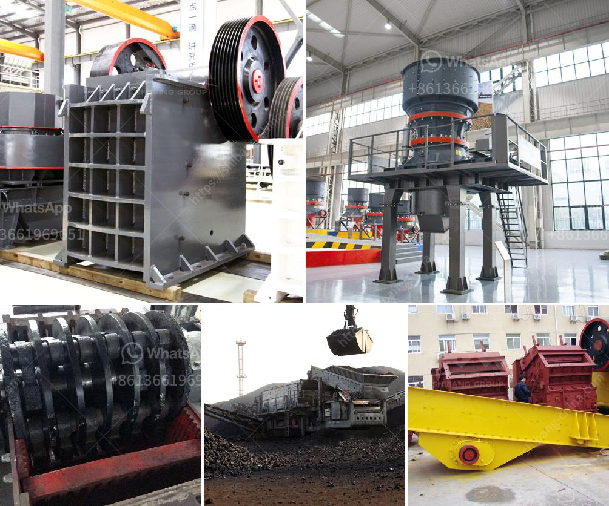

<h3>grinding mill manufacturers</h3>
Grinding mills are an essential part of many industrial processes, and they require efficient and reliable equipment to produce the desired end product. As a result, grinding mill manufacturers play a critical role in the development and manufacture of these widely used machines.

With advancements in technology and a growing demand for more efficient grinding solutions, manufacturers have been constantly innovating to meet the needs of various industries. These manufacturers are dedicated to developing grinding mills that not only improve the grinding process but also minimize energy consumption and environmental impact.

One key area of focus for grinding mill manufacturers is energy efficiency. Energy costs make up a large portion of the operational expenses in grinding mills, and manufacturers aim to reduce these costs by designing mills with features that enhance efficiency. For example, many modern mills employ smart technologies that automatically adjust their speed and power usage based on the material being processed. This level of automation ensures that the mill operates at optimal efficiency, reducing energy consumption and increasing productivity.

Another area where grinding mill manufacturers are innovating is in the development of eco-friendly mills. With a growing emphasis on sustainable practices, manufacturers are striving to create grinding mills that minimize environmental impact. This includes reducing emissions, implementing effective dust control measures, and recycling or repurposing mill waste. By adopting such sustainable practices, manufacturers not only contribute to a greener future but also meet the expectations of environmentally conscious consumers.

Moreover, grinding mill manufacturers are continuously exploring new materials and design concepts to improve the durability and reliability of their products. They invest heavily in research and development to enhance the wear resistance of mill components, such as liners and grinding media, to extend the operational life of the mills. Additionally, manufacturers strive to provide mills with improved safety features, ensuring the well-being of workers during operation.

Cost-effectiveness is another crucial aspect that grinding mill manufacturers aim to achieve. By improving the efficiency and durability of their mills, they help reduce maintenance costs and downtime, resulting in higher productivity and profitability for their customers. Additionally, manufacturers often offer tailored solutions, providing mills that are customized to meet specific requirements, whether it be throughput capacity, size reduction needs, or processing different materials.

The competition among grinding mill manufacturers is fierce, and this drives continuous innovation in the field. Manufacturers are constantly researching and developing new technologies, incorporating feedback from customers and industry experts, and keeping pace with evolving industry standards and regulations.

In conclusion, grinding mill manufacturers play a vital role in providing efficient and reliable grinding solutions for various industries. With a focus on energy efficiency, environmental sustainability, durability, and cost-effectiveness, these manufacturers continually strive to enhance their products and meet the evolving needs of the market. By investing in research and development and embracing new technologies, they pave the way for more advanced and efficient grinding processes, contributing to the overall growth and success of industries around the world.
<h3>Contact us</h3><ul><li><strong>Whatsapp:&nbsp;<a href="https://wa.me/8613661969651">+8613661969651</a></strong></li><li><a href="https://swt.shibang-china.com/?git&amp;zhl&amp;grinding mill manufacturers"><strong>Online Service(chat now)</strong></a></li></ul><h3>Related</h3><ul><li><a href='cement plant in turkey.md'>cement plant in turkey</a></li><li><a href='hammer mill crusher type.md'>hammer mill crusher type</a></li><li><a href='portland cement processing units.md'>portland cement processing units</a></li><li><a href='crusher repairs south africa.md'>crusher repairs south africa</a></li><li><a href='graphite beneficiation plant at nigeria.md'>graphite beneficiation plant at nigeria</a></li></ul>