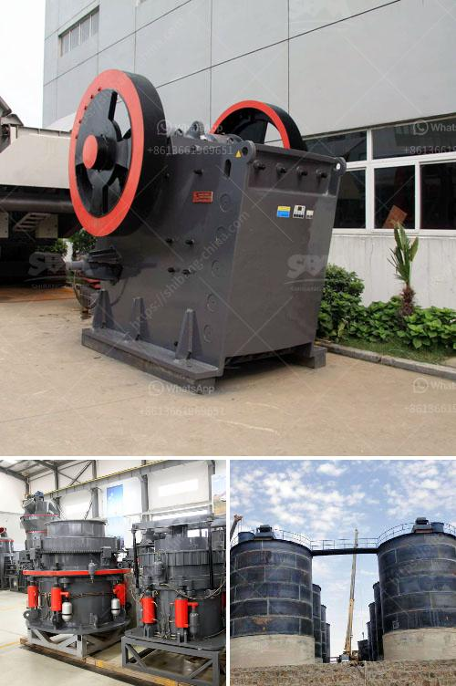

<h3>grinding mills ghana</h3>
Ghana is no exception when it comes to technology adoption and its impact on changing social and economic environments. The country is undergoing rapid urbanization and industrialization, resulting in an increased demand for food supplies. As a result, Ghana's agricultural sector is witnessing a transformative shift towards mechanization, aiming to enhance productivity and reduce post-harvest losses. One such innovation aiding this transition is the use of grinding mills in Ghana.

Grinding mills have become indispensable machines in Ghana's agricultural sector, improving livelihoods by reducing laborious manual tasks and increasing efficiency. These mills are used to process a wide range of agricultural products such as maize, beans, sorghum, millet, and cassava, among others. They are high-speed machines that run on electricity and are designed to grind grains and other raw materials into fine powders or pastes.

One of the key advantages of using grinding mills in Ghana is that they allow farmers and small-scale processors to add value to their products. Traditionally, farmers would have to manually pound or grind their crops, which was labor-intensive and time-consuming. With the advent of grinding mills, farmers can now easily process their produce, improving the quality, texture, and marketability of their products. This helps them fetch better prices in the market, ultimately leading to improved livelihoods.

Additionally, grinding mills are contributing to reducing post-harvest losses in Ghana. Due to a lack of proper storage facilities and infrastructure, farmers often face significant losses after harvest. Crops get spoiled due to insect infestation, mould growth, or excessive moisture. By processing their crops into powders or pastes immediately after harvesting, farmers can extend the shelf life of their products and reduce post-harvest losses, resulting in increased incomes and reduced food waste.

Moreover, grinding mills promote food safety and hygiene. Traditional grinding methods involved pounding crops manually with tools such as mortars and pestles. This manual process often resulted in a significant amount of dust particles mixing with the food. With grinding mills, the process is automated, minimizing contamination risks and ensuring that the end product is safe for consumption. This is of utmost importance, especially in a country like Ghana, where foodborne illnesses can have severe consequences on public health.

However, challenges remain in the widespread adoption of grinding mills in Ghana. Affordability is still a significant barrier for many small-scale farmers and processors. The initial investment cost for acquiring grinding mills can be quite substantial, making it unaffordable for some. Efforts are being made by the government and non-governmental organizations to provide subsidies, loans, or financing options to enable farmers and processors to access these machines.

Moreover, education and awareness campaigns are crucial to highlight the benefits and potential of grinding mills in enhancing agricultural productivity and improving livelihoods in Ghana. Training programs should be organized to equip farmers and processors with the necessary skills to operate and maintain these machines effectively. Furthermore, collaboration between government agencies, research institutions, and the private sector can accelerate the development and adoption of more affordable and efficient grinding mill technologies in Ghana.

Grinding mills have the potential to revolutionize Ghana’s agricultural sector by increasing productivity, reducing post-harvest losses, improving food safety, and enhancing the incomes of farmers and small-scale processors. With the right policies, investments, and support, Ghana can harness the power of grinding mills to propel its agricultural sector towards sustainable development and economic growth.
<h3>Contact us</h3><ul><li><strong>Whatsapp:&nbsp;<a href="https://wa.me/8613661969651">+8613661969651</a></strong></li><li><a href="https://swt.shibang-china.com/?git&amp;zhl&amp;grinding mills ghana"><strong>Online Service(chat now)</strong></a></li></ul><h3>Related</h3><ul><li><a href='quartz stone crusher application.md'>quartz stone crusher application</a></li><li><a href='chinese diesel propelled stone crushers for sale.md'>chinese diesel propelled stone crushers for sale</a></li><li><a href='granite stone processing plant.md'>granite stone processing plant</a></li><li><a href='cement plant in riyadh.md'>cement plant in riyadh</a></li><li><a href='ball mill in romania.md'>ball mill in romania</a></li></ul>