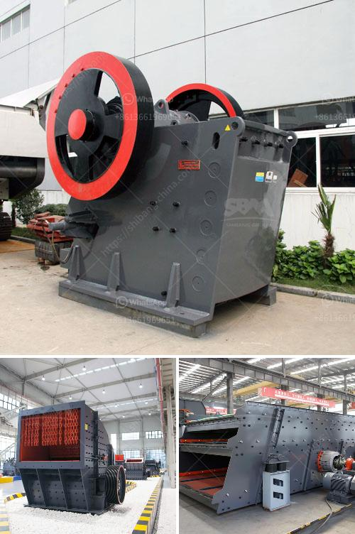

<h3>grinding mills jalandhar</h3>
Jalandhar, a bustling city in the state of Punjab, has long been recognized as a significant industrial hub, particularly renowned for its manufacturing sector. Among the various industries thriving in Jalandhar, the grinding mills sector holds a prominent position. These grinding mills play a vital role in numerous industries, making them an essential part of Jalandhar's industrial landscape.

Grinding mills are machines designed to break solid materials into smaller pieces through the process of grinding or crushing. The materials that are commonly processed in grinding mills include minerals, chemicals, and other similar substances. This mechanical process is vital for various industries, such as construction, agriculture, and mining, as it helps in refining and enhancing the quality of raw materials.

Jalandhar's grinding mills industry has experienced remarkable growth over the years, primarily due to the city's favorable geographical location and a well-established industrial infrastructure. With easy access to raw materials and a dense network of suppliers, Jalandhar has become a go-to destination for businesses seeking grinding mills for their operations.

One of the key factors contributing to Jalandhar's dominance in the grinding mills sector is its diverse range of mills available. From ball mills to rod mills, hammer mills to vertical mills, Jalandhar offers a wide array of grinding mills to cater to different requirements. This variety allows industries to select the most suitable mill for their specific needs and optimize their manufacturing processes.

Moreover, Jalandhar's grinding mills are renowned for their reliability, efficiency, and high performance. These mills are manufactured using cutting-edge technology, ensuring their durability and effectiveness. The use of advanced machinery and techniques also enhances the precision and accuracy of grinding processes, enabling industries to achieve desired particle sizes and consistency in their end products.

To support the grinding mills industry, Jalandhar also boasts a robust ecosystem of suppliers and ancillary services. From spare parts manufacturers to maintenance and repair service providers, a comprehensive network of businesses has evolved around the grinding mills sector. This not only facilitates easy procurement of equipment but also ensures timely assistance and support for maintenance and repairs, minimizing downtime for industries.

Furthermore, the presence of grinding mills in Jalandhar has had a positive impact on the local economy. The surge in grinding mills' demand has resulted in increased employment opportunities, attracting skilled workers from various parts of the country. This influx of talent has not only boosted Jalandhar's economy but has also led to knowledge exchange and skill development, further enhancing the city's industrial capabilities.

In conclusion, Jalandhar's grinding mills sector has emerged as a vital component of the city's industrial landscape. Its diverse range of mills, coupled with the use of advanced technology, has made Jalandhar a preferred destination for industries seeking grinding solutions. With a robust ecosystem of suppliers and support services, Jalandhar continues to thrive as a hub for grinding mills, contributing to its growth and prosperity.
<h3>Contact us</h3><ul><li><strong>Whatsapp:&nbsp;<a href="https://wa.me/8613661969651">+8613661969651</a></strong></li><li><a href="https://swt.shibang-china.com/?git&amp;zhl&amp;grinding mills jalandhar"><strong>Online Service(chat now)</strong></a></li></ul><h3>Related</h3><ul><li><a href='diy stone crushing machine.md'>diy stone crushing machine</a></li><li><a href='cara pemasangan belt conveyor.md'>cara pemasangan belt conveyor</a></li><li><a href='crushed price impact crusher price.md'>crushed price impact crusher price</a></li><li><a href='rock crusher in africa.md'>rock crusher in africa</a></li><li><a href='plant crushing materials in antioquia.md'>plant crushing materials in antioquia</a></li></ul>