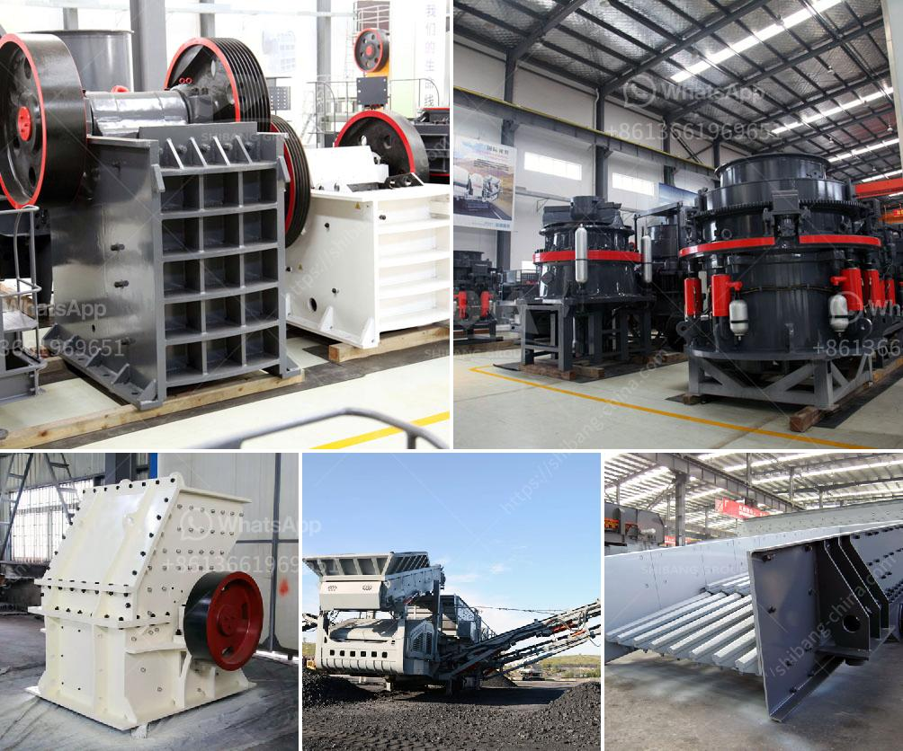

<h3>grinding of limestone mill grinding</h3>
Limestone is a sedimentary rock known for its durability and versatility. It is widely used in various industries such as construction, agriculture, and even household applications. However, before limestone can be used in these fields, it needs to undergo a significant process called grinding.

Grinding of limestone is a complex process that requires high-quality equipment. As the demand for limestone continues to grow, the need for efficient and reliable grinding equipment is paramount. This is where limestone mill grinding comes into play.

Limestone mill grinding refers to the process of reducing the size of limestone particles by using a mill. This process is a crucial step in the production of many different products, including cement, paint, and even food products.

The primary objective of limestone mill grinding is to enable the limestone to be utilized effectively and efficiently. By reducing the size of the particles, the surface area of the limestone increases, allowing for better interaction with other materials and improving the overall quality of the end product.

There are several types of mills used for limestone grinding, including ball mills, Raymond mills, and vertical mills. Each type offers different advantages and is suitable for specific applications. For example, ball mills are commonly used in the cement industry due to their ability to produce a fine and uniform grind. On the other hand, Raymond mills are often used in the paint industry due to their ability to produce a smooth and consistent grind.

One of the key benefits of limestone mill grinding is its ability to control the particle size distribution. By adjusting the speed of the mill, the grinding media, and the feed rate, operators can achieve the desired particle size. This level of control ensures that the final product meets the specific requirements of the application.

In addition to controlling the particle size distribution, limestone mill grinding also helps to eliminate impurities from the limestone. As the limestone particles are ground, any impurities or contaminants present in the raw material are separated, resulting in a cleaner and purer form of limestone. This is particularly important in industries where high-quality raw materials are crucial.

Furthermore, limestone mill grinding offers significant energy savings compared to other grinding methods. Due to the efficient design of the mills and the ability to control the grinding process, less energy is required to achieve the desired particle size. This not only reduces operating costs but also contributes to a more sustainable and environmentally friendly operation.

Overall, limestone mill grinding plays a vital role in unlocking the true potential of limestone. By effectively reducing the particle size, controlling the distribution, and eliminating impurities, limestone can be used to its full extent in various applications. With the continuous advancements in grinding technology, limestone mill grinding is becoming more efficient, reliable, and sustainable, ensuring a bright future for this versatile rock.
<h3>Contact us</h3><ul><li><strong>Whatsapp:&nbsp;<a href="https://wa.me/8613661969651">+8613661969651</a></strong></li><li><a href="https://swt.shibang-china.com/?git&amp;zhl&amp;grinding of limestone mill grinding"><strong>Online Service(chat now)</strong></a></li></ul><h3>Related</h3><ul><li><a href='raymond mill manufacturers in.md'>raymond mill manufacturers in</a></li><li><a href='germany stone crusher machine factories.md'>germany stone crusher machine factories</a></li><li><a href='indonesia coal screen machine.md'>indonesia coal screen machine</a></li><li><a href='limestone micronizer machine limestone micronizer mill.md'>limestone micronizer machine limestone micronizer mill</a></li><li><a href='small gold mining plant in south africa.md'>small gold mining plant in south africa</a></li></ul>