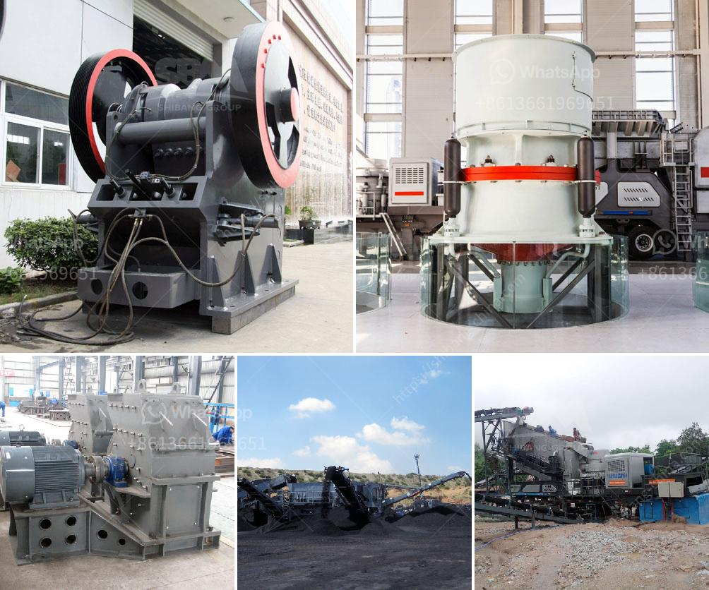

<h3>grinding plant supplier</h3>
In the ever-evolving industrial landscape, grinding plants play a crucial role in various sectors, such as mining, cement production, and chemical processing. These plants are responsible for grinding raw materials into fine powders, enabling the production of high-quality products. As the demand for grinding solutions continues to soar, the importance of reliable grinding plant suppliers becomes evident.

A grinding plant supplier is an entity that designs, manufactures, and delivers grinding plants to industries in need. These suppliers often possess expertise in engineering, metallurgy, and manufacturing, allowing them to provide tailor-made solutions for specific grinding requirements. They work closely with their clients, understanding their needs and challenges to develop efficient and cost-effective grinding systems.

One of the key advantages of working with a grinding plant supplier is their ability to offer a comprehensive range of equipment. From ball mills and vertical roller mills to rod mills and autogenous mills, they have a diverse portfolio to cater to different grinding processes. These suppliers are also proficient in designing and optimizing grinding circuits, minimizing energy consumption and maximizing productivity, all while maintaining quality standards.

Quality and reliability are the hallmarks of a reputable grinding plant supplier. They employ stringent quality control measures to ensure that their products meet international standards. This includes conducting various tests on the materials used, ensuring the precision of machining processes, and conducting performance checks. By adhering to strict quality protocols, these suppliers deliver grinding plants that are durable, efficient, and capable of withstanding demanding operating conditions.

Furthermore, grinding plant suppliers often invest in research and development to stay ahead in the market. They work towards developing advanced grinding technologies, incorporating automation and digitalization to enhance efficiency and productivity further. By leveraging cutting-edge techniques, they can offer state-of-the-art grinding solutions that not only meet current industry standards but also meet the demands of future advancements.

Collaboration between grinding plant suppliers and their clients is essential to achieve optimal results. Suppliers work closely with their clients, gaining an in-depth understanding of their specific grinding needs. By conducting comprehensive feasibility studies and analyzing process parameters, they can develop customized solutions that perfectly match the client's requirements. This collaborative approach ensures that the supplied grinding plants integrate seamlessly into existing production processes, resulting in increased efficiency and reduced maintenance costs.

Considering the growing number of industries demanding grinding solutions, the role of grinding plant suppliers is becoming increasingly critical. In addition to providing quality equipment, they also offer extensive aftersales services. These services encompass plant commissioning, operator training, and technical support, ensuring that clients can maximize the performance of their grinding systems and optimize their overall operations.

In conclusion, a grinding plant supplier is a valuable partner for industries in need of grinding solutions. With their expertise, they design, manufacture, and deliver high-quality grinding plants that cater to specific requirements. Their commitment to quality, research, and development, as well as collaborative client partnerships, position them as vital players in meeting the burgeoning demand for efficient and effective grinding systems.
<h3>Contact us</h3><ul><li><strong>Whatsapp:&nbsp;<a href="https://wa.me/8613661969651">+8613661969651</a></strong></li><li><a href="https://swt.shibang-china.com/?git&amp;zhl&amp;grinding plant supplier"><strong>Online Service(chat now)</strong></a></li></ul><h3>Related</h3><ul><li><a href='belt conveyor of cement plant technical data and price.md'>belt conveyor of cement plant technical data and price</a></li><li><a href='used sand washing machine for sale.md'>used sand washing machine for sale</a></li><li><a href='equipment used in quarry crusher.md'>equipment used in quarry crusher</a></li><li><a href='6inch rock crushing mill in guatemala.md'>6inch rock crushing mill in guatemala</a></li><li><a href='jaw crusher animation.md'>jaw crusher animation</a></li></ul>