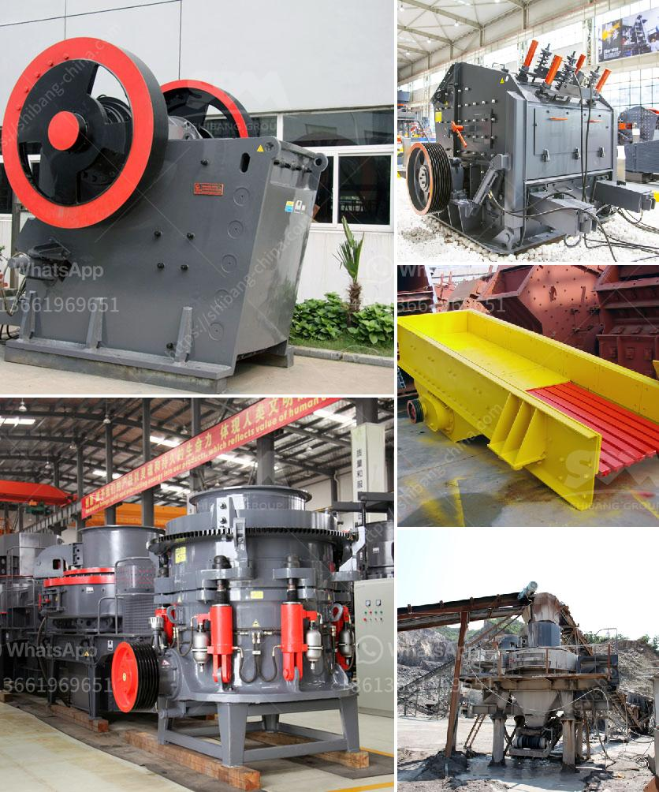

<h3>grinding units of feldspar</h3>
Feldspar, a group of rock-forming minerals, is one of the most abundant minerals found on Earth. Comprising nearly 60% of the Earth's crust, feldspar is commonly found in igneous, metamorphic, and sedimentary rocks. Its versatile properties make it an essential component in various industries, including ceramics, glassmaking, and construction. One of the crucial steps in maximizing the potential of feldspar is the grinding process, where specialized grinding units play a vital role.

Feldspar mining predominantly involves extraction in the form of open-pit mining or underground mining. Once the feldspar ore is obtained, it goes through a series of processes to improve its purity and quality. Grinding is an integral part of these processes. By grinding the feldspar ore into smaller particles, the surface area increases, allowing for better chemical reactivity and improved processing efficiency.

Grinding units for feldspar are mechanical devices designed to reduce the size of feldspar particles through a grinding mechanism. These units come in various sizes and configurations to cater to different production requirements. Some common types of grinding units used for feldspar include ball mills, rod mills, hammer mills, and vertical roller mills.

Ball mills are widely used in the ceramic and mining industries to grind materials into a fine powder. In the case of feldspar, ball mills are durable and efficient grinding units capable of processing large quantities of ore. The grinding process in a ball mill involves impact and attrition forces, resulting in the reduction of particle size. The use of grinding aids can further enhance the efficiency of ball mills, improving the overall grinding performance.

Rod mills, on the other hand, are suitable for coarse grinding applications. They utilize long cylindrical rods as the grinding media and are often used in the mining industry. Rod mills are capable of grinding larger-sized feldspar particles and are known for their efficient and reliable performance.

Hammer mills are another type of grinding unit used for feldspar grinding. In a hammer mill, high-speed rotating hammers are used to pulverize the material. The impact of the hammers on the ore particles results in size reduction. Hammer mills are versatile units that can handle a wide range of materials, making them ideal for feldspar grinding.

Vertical roller mills (VRMs) have gained popularity in recent years due to their energy efficiency and small footprint. In a VRM, a grinding table with rollers presses against the material, grinding it between the rollers and the table. VRMs are particularly advantageous for fine grinding applications, as they offer better control over particle size distribution.

The benefits of grinding units for feldspar are numerous. Firstly, the grinding process enhances the reactivity of feldspar, improving its performance in ceramic glazes and glassmaking. Smaller particle size also improves the homogeneity of the final product, resulting in a more consistent quality. Grinding units also minimize wastage of the valuable mineral by ensuring that all particles are properly processed. Additionally, grinding units contribute to environmental sustainability by reducing the energy consumption and carbon footprint of production processes.

In conclusion, grinding units for feldspar play a critical role in unlocking the full potential of this versatile mineral. By reducing the size of feldspar particles, grinding units enhance its reactivity and improve the efficiency of downstream processes. The diverse range of grinding units available ensures that there is an appropriate solution for every production requirement. With the growing demand for feldspar in various industries, the development and optimization of grinding units continue to be an area of focus.
<h3>Contact us</h3><ul><li><strong>Whatsapp:&nbsp;<a href="https://wa.me/8613661969651">+8613661969651</a></strong></li><li><a href="https://swt.shibang-china.com/?git&amp;zhl&amp;grinding units of feldspar"><strong>Online Service(chat now)</strong></a></li></ul><h3>Related</h3><ul><li><a href='pebble crusher for grinding mill.md'>pebble crusher for grinding mill</a></li><li><a href='cone crusher manufacturers china.md'>cone crusher manufacturers china</a></li><li><a href='cement crusher machines price in india.md'>cement crusher machines price in india</a></li><li><a href='pe 400 jaw crusher.md'>pe 400 jaw crusher</a></li><li><a href='medium ballast making machine.md'>medium ballast making machine</a></li></ul>