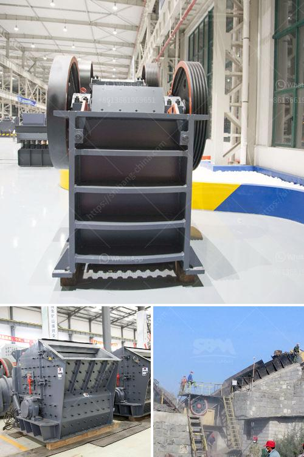

<h3>grizzly coal mining equipment</h3>
Coal mining remains a significant contributor to global energy production, meeting a considerable portion of the world's energy needs. However, this industry requires heavy-duty machinery to extract the precious resource from deep underground. Among the crucial equipment used in coal mining operations is the grizzly.

A grizzly is an essential piece of equipment that helps enhance the efficiency and safety of coal mining operations. Essentially, a grizzly is a large, heavy-duty screen or grid that prevents oversized materials from entering the primary crusher or processing plant while allowing smaller-sized coal to pass through. This ensures that only properly sized coal enters the processing plant, reducing wear and tear on equipment and increasing its overall lifespan.

One of the key advantages of grizzly coal mining equipment is its ability to handle large quantities of coal. Grizzlies are designed to withstand the harsh conditions of coal mines, making them durable and long-lasting. They are typically made from strong materials such as steel, capable of withstanding heavy loads and resisting wear caused by the abrasive nature of coal.

Furthermore, grizzlies play a vital role in ensuring the safety of miners. By removing oversized materials, they help prevent blockages in crushers or processing plants, reducing the risk of machinery malfunctions and breakdowns that may result in accidents. Additionally, grizzlies allow miners to identify and remove any unwanted debris or foreign objects that may pose safety hazards.

Modern grizzlies also incorporate advanced technology and automation, further improving efficiency and safety in coal mining operations. Cutting-edge features, such as remote monitoring and control systems, enable operators to monitor grizzly performance and adjust settings as needed. This helps optimize operations, reducing downtime and increasing productivity.

In conclusion, grizzly coal mining equipment is a valuable asset to the industry. Its ability to handle large quantities of coal, enhance safety, and incorporate advanced technology showcases its importance in modern mining operations. By effectively separating oversized materials, grizzlies contribute to the efficiency of coal processing plants and reduce machinery wear and tear. As long as coal mining remains a significant part of the global energy landscape, the demand for grizzlies will continue to grow, making them a vital tool for the extraction and processing of this valuable resource.
<h3>Contact us</h3><ul><li><strong>Whatsapp:&nbsp;<a href="https://wa.me/8613661969651">+8613661969651</a></strong></li><li><a href="https://swt.shibang-china.com/?git&amp;zhl&amp;grizzly coal mining equipment"><strong>Online Service(chat now)</strong></a></li></ul><h3>Related</h3><ul><li><a href='mining process for perlite.md'>mining process for perlite</a></li><li><a href='fdiferentes areas of stone crusher.md'>fdiferentes areas of stone crusher</a></li><li><a href='price of a stone crusher machine in zambia.md'>price of a stone crusher machine in zambia</a></li><li><a href='crusher and screening plant.md'>crusher and screening plant</a></li><li><a href='crushers plant price.md'>crushers plant price</a></li></ul>