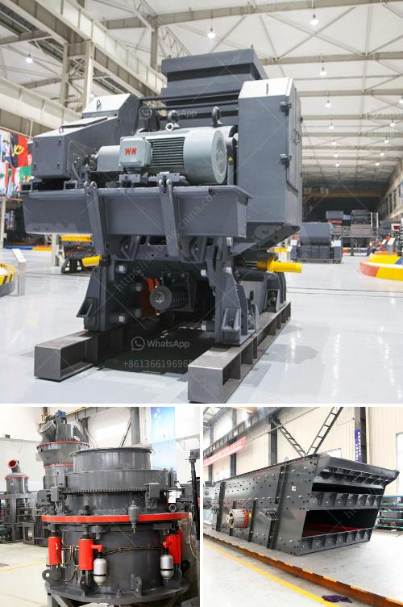

<h3>gypsum board making process</h3>
Gypsum board, also known as drywall or plasterboard, is one of the most common materials used in construction. It is manufactured by mixing gypsum, a naturally occurring mineral, with water and additives before shaping it into thin sheets. The process of making gypsum board involves several steps that ensure its quality and durability.

The first step in the gypsum board making process is mining gypsum from quarries or underground mines. The gypsum is then crushed into smaller pieces and heated in a kiln to remove any moisture content. Once the heating process is complete, the gypsum is ground into a fine powder.

The next step in the process is mixing the powdered gypsum with water and additives in a mixing chamber. The additives may include varies substances, such as foaming agents or fire-resistant materials, to enhance the properties of the final gypsum board. The mixture is then poured onto a moving belt or conveyor system that spreads the gypsum evenly across the surface.

As the gypsum mixture is spread onto the conveyor, it passes through a set of rollers that compress it to the desired thickness. This compression process helps to remove any excess water and ensures uniformity in the board's thickness.

Once the gypsum board reaches its desired thickness, it is cut into specific lengths and transferred to a dryer. The dryer removes any leftover moisture and prepares the boards for the next stage of the process.

After drying, the gypsum boards are gradually cooled and then cut into smaller, manageable sizes. These smaller boards are then trimmed, shaped, and given a protective coating to improve their durability. Finally, the boards are stacked and packaged for distribution to construction sites.

The gypsum board making process is highly mechanized and efficient, allowing for large-scale production to meet the demands of the construction industry. The resulting gypsum boards are versatile, lightweight, fire-resistant, and easy to install, making them a popular choice for interior wall and ceiling applications.

In conclusion, the making of gypsum board involves a series of precise and controlled steps to ensure its quality and performance. From mining and crushing the gypsum to shaping and drying the boards, each stage is critical in producing high-quality gypsum board that meets industry standards. The popularity of gypsum board in construction can be attributed to its ease of use, affordability, and durability.
<h3>Contact us</h3><ul><li><strong>Whatsapp:&nbsp;<a href="https://wa.me/8613661969651">+8613661969651</a></strong></li><li><a href="https://swt.shibang-china.com/?git&amp;zhl&amp;gypsum board making process"><strong>Online Service(chat now)</strong></a></li></ul><h3>Related</h3><ul><li><a href='sand washer for price.md'>sand washer for price</a></li><li><a href='quartz plants in india.md'>quartz plants in india</a></li><li><a href='3 mesh vibrating screen.md'>3 mesh vibrating screen</a></li><li><a href='cone crusher in china cone.md'>cone crusher in china cone</a></li><li><a href='concrete crusher business proposal.md'>concrete crusher business proposal</a></li></ul>