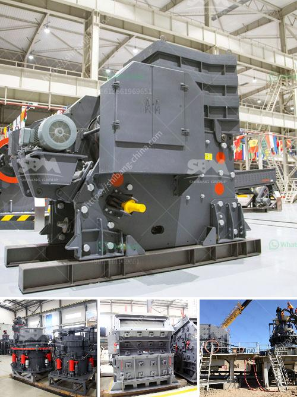

<h3>gypsum board manufacturing machines prices inindia</h3>
Gypsum board, also known as drywall or plasterboard, is a building material used in the construction industry for the creation of interior walls and ceilings. It provides a smooth and durable surface that is easy to paint and decorate. With the increase in demand for construction materials in India, the gypsum board manufacturing industry is experiencing significant growth.

When it comes to setting up a gypsum board manufacturing unit, one of the crucial aspects to consider is the cost of the machines involved in the production process. The prices of gypsum board manufacturing machines in India can vary depending on various factors such as capacity, automation level, and quality of the equipment.

Generally, the prices of gypsum board manufacturing machines in India range from INR 1,500,000 to INR 15,000,000 or even more. The lower-priced machines are typically manual or semi-automatic with a lower production capacity, while the higher-priced machines are fully automatic with a higher production capacity.

Some of the key machines required in the gypsum board manufacturing process include raw material preparation equipment, gypsum board forming machine, setting conveyor, drying oven, trimming machine, and packaging machine. Each machine contributes to a specific stage of the manufacturing process.

It is essential to choose machines that are efficient, reliable, and of good quality to ensure a smooth production process and high-quality gypsum boards. Investing in high-quality machines can lead to higher productivity, reduced operational costs, and better product quality, ultimately maximizing profitability in the long run.

It is advisable to research and compare different manufacturers and suppliers to get a comprehensive understanding of the market and select the machines that best suit the requirements and budget. Additionally, considering after-sales service, warranty, and technical support provided by the manufacturer is crucial when finalizing the purchase decision.

In conclusion, the prices of gypsum board manufacturing machines in India can vary based on capacity, automation level, and quality. Investing in high-quality machines is essential for efficient production, cost optimization, and superior product quality. Thorough research and comparison among manufacturers can help make an informed decision while setting up a gypsum board manufacturing unit in India.
<h3>Contact us</h3><ul><li><strong>Whatsapp:&nbsp;<a href="https://wa.me/8613661969651">+8613661969651</a></strong></li><li><a href="https://swt.shibang-china.com/?git&amp;zhl&amp;gypsum board manufacturing machines prices inindia"><strong>Online Service(chat now)</strong></a></li></ul><h3>Related</h3><ul><li><a href='rock crusher from china.md'>rock crusher from china</a></li><li><a href='single super phosphate plants in germany.md'>single super phosphate plants in germany</a></li><li><a href='feldspar powder suppliers.md'>feldspar powder suppliers</a></li><li><a href='used grinding mills in nigeria.md'>used grinding mills in nigeria</a></li><li><a href='sand vsi crusher.md'>sand vsi crusher</a></li></ul>