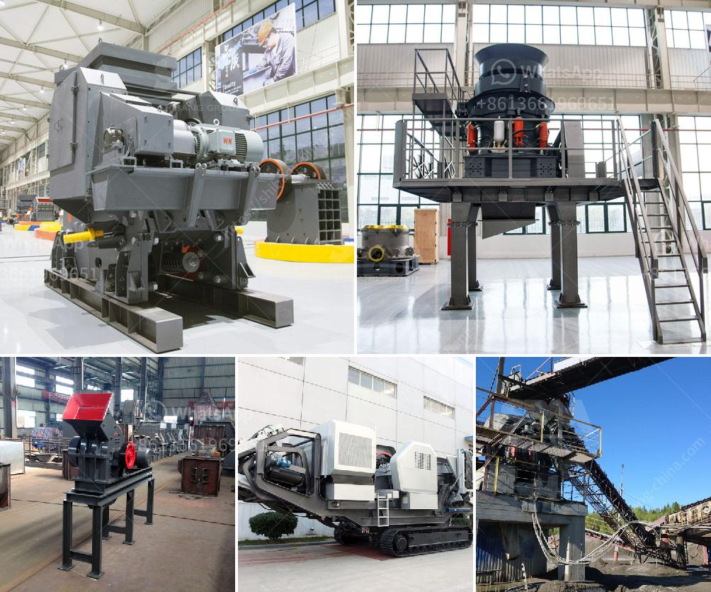

<h3>gypsum board manufacturing plant in turkey</h3>
Gypsum board, also known as drywall or plasterboard, is a building material used for walls, ceilings, and partitions in construction. In recent years, the demand for gypsum board has been steadily increasing in Turkey due to the country's growing construction sector.

Turkey has a robust manufacturing industry, and this includes gypsum board production. There are several gypsum board manufacturing plants in the country, with advanced technology and high-quality gypsum being used to produce boards of various sizes, thicknesses, and designs.

One such manufacturing plant in Turkey stands out for its state-of-the-art facilities and commitment to sustainability. The plant utilizes modern machinery and equipment to ensure the highest level of efficiency and productivity. Advanced production techniques are employed to ensure consistent quality, and stringent quality control measures are in place throughout the manufacturing process.

Moreover, this gypsum board manufacturing plant in Turkey is also eco-friendly. The company employs various environmentally conscious practices, including water recycling, waste management, and energy-saving initiatives. By adopting these sustainable measures, the plant minimizes its carbon footprint and contributes to the preservation of the environment.

The gypsum boards produced by this Turkish manufacturing plant are known for their excellent strength, durability, and fire resistance properties. These boards are ideal for both residential and commercial applications, providing a cost-effective solution for interior finishes.

Furthermore, the plant also offers customized gypsum board designs, catering to the specific needs and preferences of customers. With a wide range of decorative designs and finishes available, these boards can enhance the aesthetics of any space.

In conclusion, Turkey boasts a thriving gypsum board manufacturing industry, with plants that prioritize quality, sustainability, and customer satisfaction. These manufacturing facilities not only meet the increasing demand for gypsum boards in the country but also contribute to the growth and development of the construction sector.
<h3>Contact us</h3><ul><li><strong>Whatsapp:&nbsp;<a href="https://wa.me/8613661969651">+8613661969651</a></strong></li><li><a href="https://swt.shibang-china.com/?git&amp;zhl&amp;gypsum board manufacturing plant in turkey"><strong>Online Service(chat now)</strong></a></li></ul><h3>Related</h3><ul><li><a href='portable home gold processing machine.md'>portable home gold processing machine</a></li><li><a href='crusher in ethiopia.md'>crusher in ethiopia</a></li><li><a href='20 tph ball mills price.md'>20 tph ball mills price</a></li><li><a href='enquiry impact crusher.md'>enquiry impact crusher</a></li><li><a href='100tph used crusher plant for sale.md'>100tph used crusher plant for sale</a></li></ul>