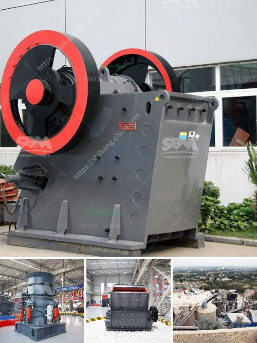

<h3>gypsum board plant cost</h3>
The cost of setting up a gypsum board manufacturing plant can vary depending on several factors. These factors include the location, size, and capacity of the plant, as well as the availability and cost of raw materials and utilities. In this article, we will discuss the approximate cost of setting up a gypsum board plant.

To begin with, it is essential to understand what gypsum board is. Gypsum board, also known as drywall or plasterboard, is a building material commonly used for interior walls and ceilings. It is made by sandwiching a layer of gypsum core between two layers of paper.

The first step in setting up a gypsum board plant is to find a suitable location. The location should have access to transportation infrastructure such as roads, rail, or ports, as gypsum board is a bulk commodity that needs to be transported in large quantities. Ideally, the location should also have access to utilities such as water, electricity, and gas, as these are crucial for manufacturing operations.

The size and capacity of the plant also affect the overall cost. A larger plant will require more land, more construction materials, and more equipment, leading to higher costs. Similarly, a higher capacity plant will require more raw materials and utilities, resulting in increased expenses.

The next major cost component is the machinery and equipment required for the manufacturing process. This includes equipment such as crushers, mills, conveyors, mixers, and board forming machines. The cost of this equipment can vary depending on the quality, brand, and capacity.

Raw materials are another significant cost factor. The main raw material for gypsum board production is gypsum, which can be sourced domestically or imported. Other raw materials include paper, additives, and starch. The availability and cost of these raw materials can vary depending on the location and market conditions.

Utilities such as water, electricity, and gas are essential for operating a gypsum board plant. The cost of utilities will depend on factors such as local rates, consumption, and efficiency of equipment and processes.

In addition to the above costs, there are also other expenses to consider, such as labor, permits and licenses, initial inventory, and marketing expenses. These costs will vary depending on the location and specific requirements.

To give an approximate idea of the cost involved, setting up a medium-sized gypsum board plant with a capacity of around 10 million square meters per year could cost anywhere between $10 million to $20 million. However, it is crucial to note that these figures are rough estimates and can vary significantly depending on the factors mentioned above.

In conclusion, setting up a gypsum board plant involves various cost components such as location, size, capacity, machinery, raw materials, utilities, and other expenses. The cost can vary significantly depending on these factors, and it is advisable to conduct a detailed feasibility study and financial analysis before embarking on such a venture.
<h3>Contact us</h3><ul><li><strong>Whatsapp:&nbsp;<a href="https://wa.me/8613661969651">+8613661969651</a></strong></li><li><a href="https://swt.shibang-china.com/?git&amp;zhl&amp;gypsum board plant cost"><strong>Online Service(chat now)</strong></a></li></ul><h3>Related</h3><ul><li><a href='cost of cement manufacturing plant tons per day.md'>cost of cement manufacturing plant tons per day</a></li><li><a href='used jaw crushers canada.md'>used jaw crushers canada</a></li><li><a href='hard stone crush maker pakistan.md'>hard stone crush maker pakistan</a></li><li><a href='basalt crushing plant.md'>basalt crushing plant</a></li><li><a href='stone crushing quarry equipment.md'>stone crushing quarry equipment</a></li></ul>