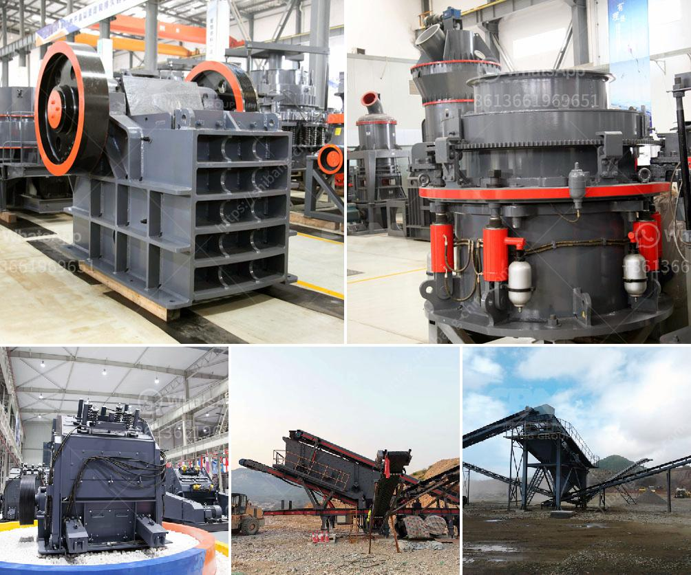

<h3>gypsum board production process</h3>
Gypsum board, also known as drywall or plasterboard, is a building material used for walls, ceilings, and partitions in both residential and commercial construction projects. It is made by combining gypsum, a natural mineral, with additives and water to form a paste, which is then poured onto a paper backing. The mixture undergoes a series of processes to transform it into a finished product.

The production process of gypsum board starts with the extraction of gypsum from mines. The mineral is first crushed into small particles, then heated to remove excess moisture. This dried gypsum is then ground into a fine powder, resulting in what is known as landplaster.

Next, additives such as starch, accelerators, and foaming agents are mixed with water to form a slurry. The slurry is then combined with the landplaster in a controlled mixing process. This step helps in achieving the desired setting time, workability, and strength of the final product.

Once the slurry is well-mixed, it is poured onto a continuous moving paper facing, which acts as a core for the gypsum board. The paper has special properties that allow it to bond with the slurry and provide strength to the board. It also helps in preventing cracks and enhances the fire-resistant properties of the board.

As the slurry is poured onto the paper, a second layer of paper is added on top to form a sandwich-like structure. This dual-layered paper provides additional strength and stability to the board. The entire assembly then passes through a forming station, where the excess slurry is removed, and the board takes shape.

After forming, the gypsum board is passed through a series of drying chambers or kilns. These chambers gradually heat the board, allowing moisture to evaporate and the board to harden. This drying process is crucial for achieving the desired strength and durability of the gypsum board.

Once the boards are dried, they are cut into standard sizes and stored for further processing or packaging. Some gypsum boards may undergo additional treatments, such as laminating with vinyl or other materials for specific applications. These treatments enhance the moisture resistance and surface finish of the boards.

Finally, the finished gypsum boards are packaged and prepared for shipment to construction sites, where they are installed by professionals. The boards are typically screwed or nailed to wooden or metal framing to form walls, ceilings, or partitions.

The production of gypsum boards is a complex and precise process that requires careful attention to detail. Each step, from raw material extraction to final product packaging, is crucial in ensuring the quality and performance of the boards. Gypsum boards are widely used in the construction industry for their fire resistance, acoustic properties, and ease of installation, making them a popular choice for building projects worldwide.
<h3>Contact us</h3><ul><li><strong>Whatsapp:&nbsp;<a href="https://wa.me/8613661969651">+8613661969651</a></strong></li><li><a href="https://swt.shibang-china.com/?git&amp;zhl&amp;gypsum board production process"><strong>Online Service(chat now)</strong></a></li></ul><h3>Related</h3><ul><li><a href='mobile iron ore impact crusher suppliers in india.md'>mobile iron ore impact crusher suppliers in india</a></li><li><a href='ballast crusher price in kenya.md'>ballast crusher price in kenya</a></li><li><a href='sand making crusher machine.md'>sand making crusher machine</a></li><li><a href='ball mills for 10 tons of ore.md'>ball mills for 10 tons of ore</a></li><li><a href='stone conveyor belt design manual pdf.md'>stone conveyor belt design manual pdf</a></li></ul>