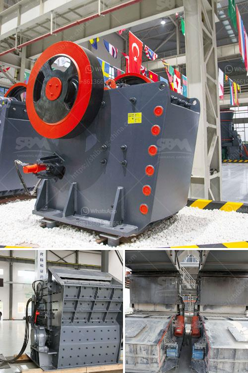

<h3>gypsum calcination equipment</h3>
Gypsum calcination, also known as plaster calcination, is the process of heating gypsum to remove the water content and convert it into stucco (calcined gypsum). This calcined gypsum is commonly used as a raw material for manufacturing various products such as plasterboard, drywall, and cement. To carry out this process efficiently, gypsum calcination equipment is required.

Gypsum calcination equipment plays a vital role in the gypsum manufacturing process. It helps in breaking down the gypsum ore and drying it simultaneously, ensuring consistent quality of the final product. There are several types of calcination equipment available in the market, each offering unique features and benefits.

One popular type of gypsum calcination equipment is the rotary kiln. The rotary kiln is a large cylindrical structure with a refractory lining where the gypsum ore is fed into one end and slowly moves towards the other end as it gets heated. The rotary motion and continuous feed ensure thorough calcination and uniform heating. The gypsum ore gradually reaches its maximum temperature and is discharged from the kiln as calcined gypsum or stucco.

Another type of equipment commonly used for gypsum calcination is the flash calciner. The flash calciner is a vertical chamber with high-temperature gas flowing in a cyclonic pattern. It operates on the principle of rapid heat transfer and short residence time. Gypsum enters the chamber and is instantly heated by the high-temperature gas stream, resulting in quick calcination. The calcined gypsum is then collected at the bottom of the chamber.

Both the rotary kiln and flash calciner offer advantages and disadvantages depending on the specific requirements of the gypsum manufacturing process. The choice of equipment depends on factors such as production capacity, energy efficiency, space availability, and final product quality.

In addition to these two main types, there are other specialized equipment available for gypsum calcination. Fluidized bed calciners use a suspension of heated particles to calcine gypsum efficiently. Multiple hearth furnaces are used for high-capacity production and can process large volumes of gypsum ore. Dehydration units and mills are also included in the complete gypsum calcination system to ensure smooth operation and optimal efficiency.

Gypsum calcination equipment manufacturers continuously strive to improve their equipment designs to enhance efficiency and reduce energy consumption. Technological advancements and automation have made the process more efficient and economical. For example, advanced control systems have been developed to optimize the calcination process and minimize variations in the final product quality.

In conclusion, gypsum calcination equipment is essential for the production of high-quality calcined gypsum. The selection of the right equipment depends on various factors and requirements. Rotary kilns, flash calciners, and other specialized equipment are commonly used for gypsum calcination. Manufacturers are constantly working on improving equipment designs and incorporating advanced technologies to enhance efficiency and quality. As the demand for gypsum-based products continues to grow, the importance of reliable and efficient gypsum calcination equipment cannot be understated.
<h3>Contact us</h3><ul><li><strong>Whatsapp:&nbsp;<a href="https://wa.me/8613661969651">+8613661969651</a></strong></li><li><a href="https://swt.shibang-china.com/?git&amp;zhl&amp;gypsum calcination equipment"><strong>Online Service(chat now)</strong></a></li></ul><h3>Related</h3><ul><li><a href='grinding machine for industrial use.md'>grinding machine for industrial use</a></li><li><a href='conveyor belts in france.md'>conveyor belts in france</a></li><li><a href='hammer mill for quartz rock.md'>hammer mill for quartz rock</a></li><li><a href='grinding plant supplier.md'>grinding plant supplier</a></li><li><a href='screw sand washing machine.md'>screw sand washing machine</a></li></ul>