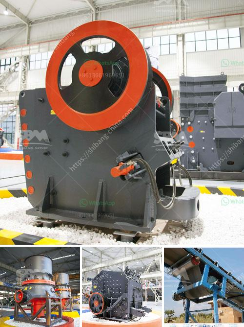

<h3>gypsum crusher for sale india</h3>
Gypsum, a valuable mineral resource, is used in various industrial applications, such as plasterboard and gypsum board. It is also widely utilized in the construction industry for producing cement and fertilizers. However, before it can be used, gypsum needs to be processed through a crushing process.

Gypsum ore, from a quarry in India, is trucked to the receiving hopper of a gypsum crusher. The gypsum crusher crushes the ore into smaller particles to facilitate the subsequent grinding and dewatering steps. Gypsum crushers are indispensable in the process of gypsum preparation.

The gypsum crusher for sale in India is ideally suitable for primary and secondary crushing. The largest compression resistance of the material to be crushed is 320 MPa. It has features of high crushing ratio, simple structure, reliable operation, easy maintenance and low operation cost.

The gypsum crushing process can be operated in underground mining or open pit mining. The extracted gypsum ore is initially crushed by a jaw crusher. The jaw crusher is popular due to its high reduction ratio, less parts wearing and simple operation. It is the main equipment in the gypsum crushing process.

After the gypsum ore is crushed by a jaw crusher, it will be transferred to a secondary crusher: impact crusher or cone crusher. Here, the gypsum particles are further crushed into smaller pieces. Impact crusher and cone crusher are commonly used as the secondary crushing equipment.

After the secondary crushing process, the gypsum particles are transported to the vibrating screen. The gypsum particles that meet the size requirements are sent back to the crusher for further crushing. The gypsum particles that do not meet the size requirements are sent to a storage bin for future use.

The gypsum crusher for sale in India is produced by using advanced crushing technology from Europe and America. It has features of high efficiency, energy saving, environmental protection, easy maintenance and low operating cost.

In addition, the gypsum crusher for sale in India is ideally suitable for both dry and wet crushing process. The dry crushing process is often used in cement production, while the wet crushing process is used in the production of plasterboard.

In conclusion, the gypsum crusher for sale in India has shown its great potential in the mining industry. It provides high quality gypsum ore for the construction industry and other industrial applications. With its reliable performance, easy maintenance and low operating cost, the gypsum crusher is becoming more and more popular in India and around the world.
<h3>Contact us</h3><ul><li><strong>Whatsapp:&nbsp;<a href="https://wa.me/8613661969651">+8613661969651</a></strong></li><li><a href="https://swt.shibang-china.com/?git&amp;zhl&amp;gypsum crusher for sale india"><strong>Online Service(chat now)</strong></a></li></ul><h3>Related</h3><ul><li><a href='manufacturers of stone crushers in usa.md'>manufacturers of stone crushers in usa</a></li><li><a href='china multifunction peeling and crushing.md'>china multifunction peeling and crushing</a></li><li><a href='limestone crusher machine in turkey.md'>limestone crusher machine in turkey</a></li><li><a href='stone crushers price.md'>stone crushers price</a></li><li><a href='small cone crushers.md'>small cone crushers</a></li></ul>