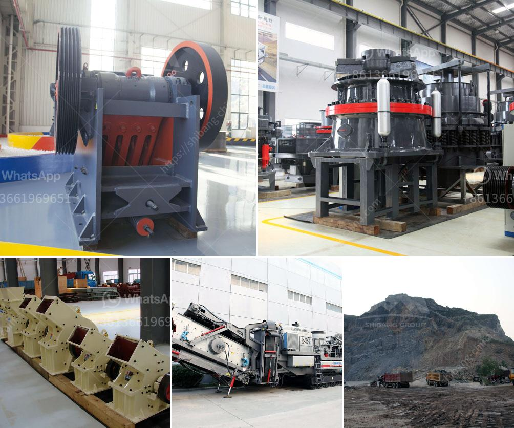

<h3>gypsum crusher in salalah oman</h3>
Gypsum is a widely used mineral in many industries, including construction and agriculture. This mineral is abundant in the Sultanate of Oman and the mining of gypsum in Oman has been a thriving industry since ancient times. In recent years, gypsum mining in Oman has seen a resurgence with the country becoming the largest exporter of gypsum worldwide.

One of the key players in this thriving industry is Salalah Oman, which is known for its vast gypsum reserves. Salalah is a city located in the southern part of Oman and has been the center of gypsum mining activity in the country. The city is strategically located near the Arabian Sea, making it an ideal location for exporting gypsum to various countries.

To efficiently extract gypsum from the mines in Salalah, the use of crushers is essential. A gypsum crusher is an important machine in the gypsum crushing process. It breaks down the large gypsum rocks into smaller, more manageable sizes, so they can be further processed.

There are various types of gypsum crushers available, each with its own unique features and benefits. However, one commonly used crusher in Salalah Oman is the jaw crusher. Jaw crushers have a fixed jaw and a moving jaw, which together form a V-shaped cavity. The movable jaw exerts force on the rock by pressing it against the fixed jaw, thus breaking it down into smaller pieces.

The gypsum crusher in Salalah Oman is designed to handle a wide range of gypsum sizes and has a high processing capacity. The machine uses a heavy-duty steel construction with a durable lining that withstands the harsh conditions of the mining site. It also has a powerful motor that ensures efficient and reliable performance.

In addition to its primary function of crushing gypsum rocks, the crusher in Salalah Oman also plays a crucial role in sorting the mined gypsum. The machine has a built-in screen that separates the gypsum into different sizes, ensuring uniformity in the final product. This step is important as it allows for better quality control and ensures that the gypsum meets the required specifications for various applications.

The gypsum crusher in Salalah Oman is not only a game-changer for the mining industry but also a boon for the local economy. The mining and processing of gypsum create job opportunities and contribute to the overall development of the region. Additionally, the export of gypsum from Salalah Oman drives economic growth, as it generates foreign exchange earnings for the country.

In conclusion, the gypsum crusher in Salalah Oman plays a pivotal role in the mining and processing of gypsum. This machine efficiently breaks down the large gypsum rocks into smaller, manageable sizes, ensuring the quality and uniformity of the final product. With the booming gypsum industry in Oman, the crusher contributes significantly to the country's economic growth and development.
<h3>Contact us</h3><ul><li><strong>Whatsapp:&nbsp;<a href="https://wa.me/8613661969651">+8613661969651</a></strong></li><li><a href="https://swt.shibang-china.com/?git&amp;zhl&amp;gypsum crusher in salalah oman"><strong>Online Service(chat now)</strong></a></li></ul><h3>Related</h3><ul><li><a href='cement clinker grinding plant in india.md'>cement clinker grinding plant in india</a></li><li><a href='raymond mill plant.md'>raymond mill plant</a></li><li><a href='rotary kiln untuk pengeringan batu kapur kapur.md'>rotary kiln untuk pengeringan batu kapur kapur</a></li><li><a href='sand washing machines for crusher nepal.md'>sand washing machines for crusher nepal</a></li><li><a href='calcium calcium carbonate plants calcium.md'>calcium calcium carbonate plants calcium</a></li></ul>