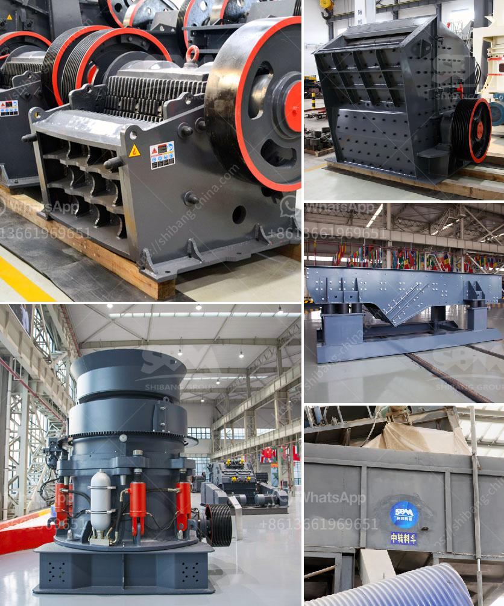

<h3>gypsum crusher manufacturing in odisha</h3>
Gypsum, a mineral composed of calcium sulfate dihydrate (CaSO4 · 2H2O), is commonly used as a building material. Known for its fire-resistant and soundproofing properties, gypsum is widely used in construction, agriculture, and industrial applications. In the state of Odisha, India, gypsum crusher manufacturing has emerged as a key industry.

Odisha, located on the eastern coast of India, is rich in mineral resources. The state has vast reserves of gypsum, making it a prime location for gypsum crusher manufacturing. Additionally, Odisha's strategic geographic location allows for easy access to major transportation networks, enabling efficient distribution of gypsum crushers across the nation.

Gypsum crusher manufacturing in Odisha has witnessed significant growth in recent years. The state government has implemented favorable policies to promote industrial development, attracting numerous manufacturers to set up their operations in the region. These policies include land allocation, tax incentives, and a streamlined approval process.

The manufacturing process of gypsum crushers involves several stages. Firstly, the raw gypsum material is extracted from mines and then transported to a crusher plant. Here, the material is crushed into smaller fragments using specialized equipment. After crushing, the gypsum undergoes further processing to eliminate impurities and achieve the desired quality.

Quality control is essential in gypsum crusher manufacturing to ensure the production of high-quality products. Manufacturers in Odisha adhere to strict quality control measures, conducting regular tests and inspections at various stages of production. This ensures that the final product meets industry standards and customer requirements.

The demand for gypsum crushers in Odisha is primarily driven by the growing construction industry. With the rapid urbanization and infrastructure development in India, there is a high demand for affordable and sustainable building materials. Gypsum, being a versatile and eco-friendly material, is widely used in the construction of residential, commercial, and industrial buildings.

Apart from the construction sector, gypsum crushers find applications in agriculture and industrial processes. In agriculture, gypsum is used as a soil amendment to improve soil structure and fertility. It helps in increasing crop yield and reducing soil erosion. In the industrial sector, gypsum crushers are used in the production of plaster of Paris, cement, and other industrial materials.

In conclusion, gypsum crusher manufacturing in Odisha has become a thriving industry due to the abundance of gypsum resources and favorable government policies. The state's strategic location and efficient transportation networks have further facilitated the growth of this sector. By producing high-quality gypsum crushers, manufacturers in Odisha are catering to the increasing demand in the construction, agriculture, and industrial sectors. As the demand for sustainable and eco-friendly building materials continues to rise, the gypsum crusher manufacturing industry in Odisha is poised for further growth and success.
<h3>Contact us</h3><ul><li><strong>Whatsapp:&nbsp;<a href="https://wa.me/8613661969651">+8613661969651</a></strong></li><li><a href="https://swt.shibang-china.com/?git&amp;zhl&amp;gypsum crusher manufacturing in odisha"><strong>Online Service(chat now)</strong></a></li></ul><h3>Related</h3><ul><li><a href='hammer mills used in kenya.md'>hammer mills used in kenya</a></li><li><a href='the price of a ball mill in india.md'>the price of a ball mill in india</a></li><li><a href='manufacture of hammer mill.md'>manufacture of hammer mill</a></li><li><a href='jaw crusher for sale in malaysia.md'>jaw crusher for sale in malaysia</a></li><li><a href='industrial ball mill.md'>industrial ball mill</a></li></ul>