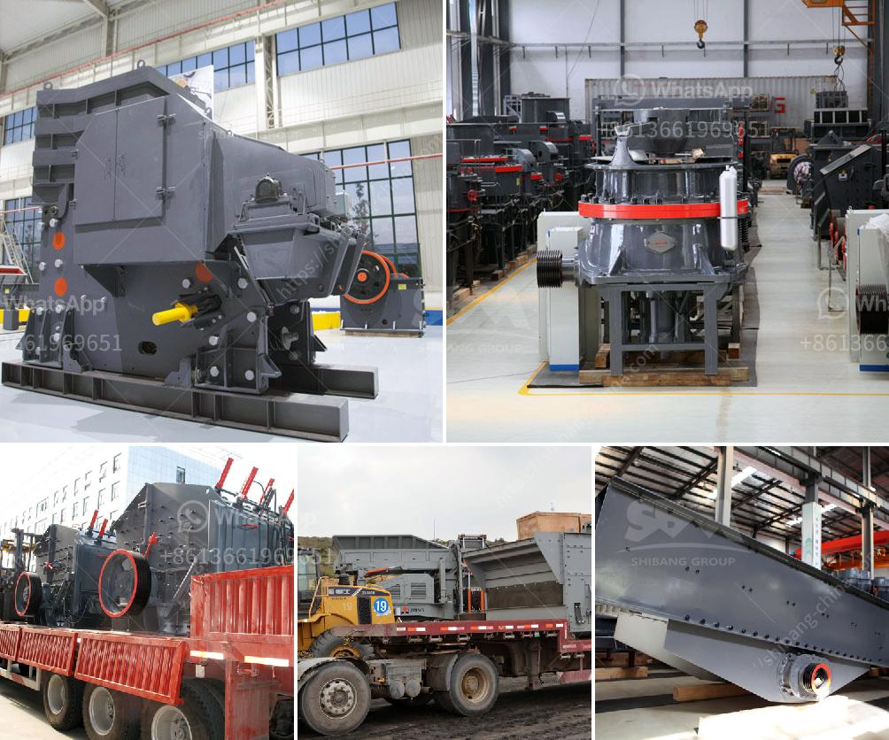

<h3>gypsum crusher plants in pakistan</h3>
Gypsum, a mineral found in abundance in many parts of Pakistan, is a crucial ingredient in the construction industry. It is used as a raw material to produce cement, plaster of Paris, and other building materials. Gypsum plants in Pakistan serve the important purpose of converting the mineral into usable products for construction and infrastructure projects.

Recently, a prominent gypsum crusher plant in Pakistan was established to process 40,000 tons of gypsum annually from a local quarry into plaster of Paris and construction materials. To meet the growing demand for gypsum in Pakistan, the plant has expanded its production capacity to 700,000 tons per annum, ensuring a steady supply of gypsum products.

Gypsum is a versatile mineral with numerous applications in diverse industries. Its primary use is in the production of construction materials such as cement, drywall, and ceiling tiles. Additionally, gypsum is used in agriculture as a soil conditioner and fertilizer, promoting healthy plant growth and improving soil structure.

The establishment of gypsum crusher plants in Pakistan has made it feasible for these valuable resources to be used effectively and efficiently. Gypsum products are a strong, durable, and lightweight material that contributes to the longevity and sustainability of numerous construction projects. They are also fire-resistant, sound-absorbing, and provide excellent insulation properties.

Furthermore, the utilization of gypsum in agriculture has proven to be crucial in enhancing crop productivity and soil health. Gypsum helps in improving water infiltration, reducing soil erosion, and preventing nutrient leaching. Its calcium content also plays a vital role in promoting root development, nutrient absorption, and overall plant health.

The expansion of gypsum crusher plants in Pakistan not only fully supports the country's construction sector but also contributes to its overall economic growth. The gypsum industry not only provides employment opportunities but also serves as a source of revenue through export earnings. With its immense potential in various industries, gypsum continues to be a valuable natural resource in Pakistan.

In conclusion, the establishment and expansion of gypsum crusher plants in Pakistan have contributed significantly to meeting the demand for gypsum products in the construction industry. These plants ensure a steady supply of high-quality gypsum, making Pakistan a competitive player in the global gypsum market. The usage of gypsum in construction and agriculture underscores its versatility and importance as a valuable natural resource that benefits various sectors in the country.
<h3>Contact us</h3><ul><li><strong>Whatsapp:&nbsp;<a href="https://wa.me/8613661969651">+8613661969651</a></strong></li><li><a href="https://swt.shibang-china.com/?git&amp;zhl&amp;gypsum crusher plants in pakistan"><strong>Online Service(chat now)</strong></a></li></ul><h3>Related</h3><ul><li><a href='gold mining and crusher machinery.md'>gold mining and crusher machinery</a></li><li><a href='conveyor belt manufacturer in china.md'>conveyor belt manufacturer in china</a></li><li><a href='ball mill specification.md'>ball mill specification</a></li><li><a href='crusher plant in nigeria pakistan.md'>crusher plant in nigeria pakistan</a></li><li><a href='hammer mills for sale in south africa.md'>hammer mills for sale in south africa</a></li></ul>