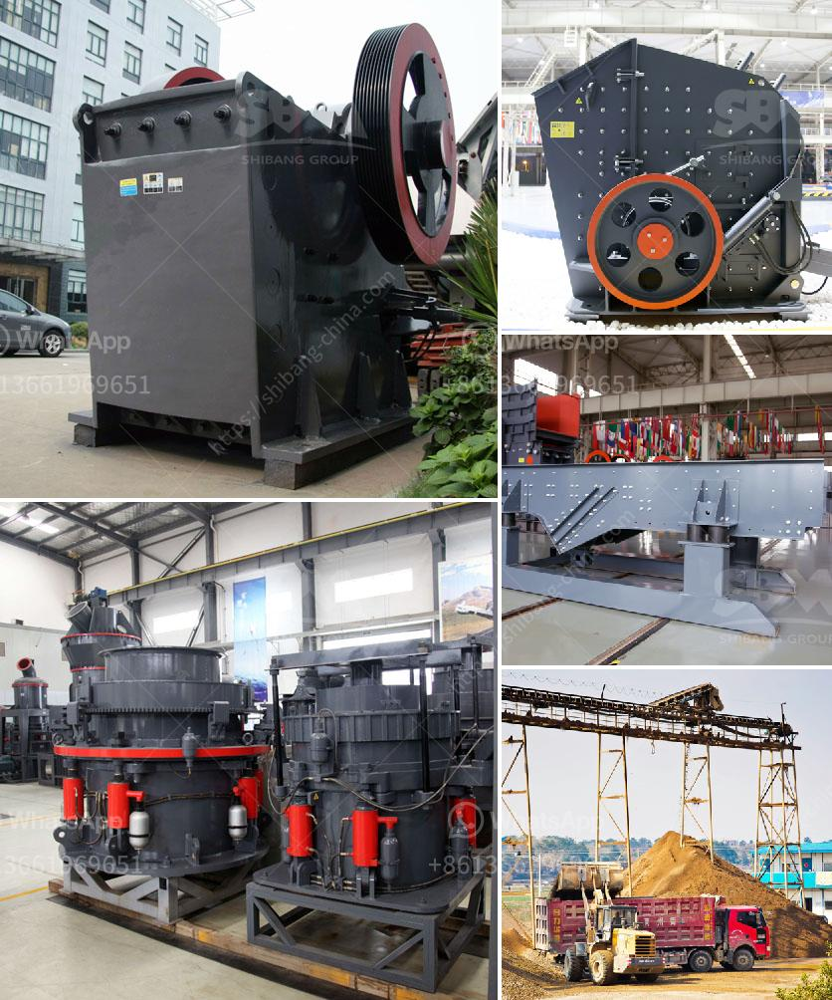

<h3>gypsum crusher supplier in uae</h3>
Gypsum is a mineral that is commonly used in construction projects. It is also known as plaster of Paris and is produced by heating gypsum rock to remove the water content. Gypsum is widely used in the construction industry as a binding material and is used for making wallboard, plaster, and cement. In the United Arab Emirates (UAE), gypsum suppliers are plentiful and offer a wide range of gypsum products.

When it comes to choosing a gypsum crusher supplier in the UAE, it is important to find a supplier that can deliver high-quality products on time and at competitive prices. To ensure that the supplier has the necessary experience and knowledge, it is important to look for a company that has been in the industry for several years. A well-established company will have a good reputation and will know how to provide excellent service to customers.

One of the key factors to consider when choosing a gypsum crusher supplier is the quality of the products they offer. The supplier should be able to provide gypsum that is of high quality and meets the required standards for construction projects. This includes meeting the specified particle size distribution, purity, and setting time.

Another important factor to consider is the availability of the gypsum products. The supplier should have a variety of gypsum products available, including different sizes and grades. This ensures that contractors and builders can find the right type of gypsum for their specific needs. Additionally, the supplier should have an adequate stock of gypsum to meet the demand of customers.

In addition to quality and availability, it is also important to consider the price of gypsum products. While it is important to find a supplier that offers competitive prices, it is equally important to ensure that the quality of the products is not compromised. The supplier should be able to offer reasonable prices without compromising on the quality of the gypsum.

Furthermore, it is important for the supplier to provide a reliable delivery service. Construction projects often have strict deadlines, and delays in the delivery of gypsum can disrupt the progress of the project. A reliable supplier will have a well-organized delivery system that ensures timely delivery of gypsum products to the construction site.

Lastly, customer service is a crucial aspect to consider when choosing a gypsum crusher supplier. The supplier should have a professional and responsive customer service team that can address any concerns or queries promptly. They should be willing to provide assistance and guidance to customers, and handle any issues that may arise during the purchasing process.

In conclusion, choosing a gypsum crusher supplier in the UAE requires careful consideration of factors such as product quality, availability, competitive prices, reliable delivery, and customer service. By selecting a reputable and experienced supplier, construction professionals can ensure that they have access to high-quality gypsum products that meet their specific requirements.
<h3>Contact us</h3><ul><li><strong>Whatsapp:&nbsp;<a href="https://wa.me/8613661969651">+8613661969651</a></strong></li><li><a href="https://swt.shibang-china.com/?git&amp;zhl&amp;gypsum crusher supplier in uae"><strong>Online Service(chat now)</strong></a></li></ul><h3>Related</h3><ul><li><a href='lime crushing plant components.md'>lime crushing plant components</a></li><li><a href='mill to pulverize stone crusher.md'>mill to pulverize stone crusher</a></li><li><a href='36 jaw crusher for rent edmonton.md'>36 jaw crusher for rent edmonton</a></li><li><a href='samp hammer mill china.md'>samp hammer mill china</a></li><li><a href='jaw crusher animation.md'>jaw crusher animation</a></li></ul>