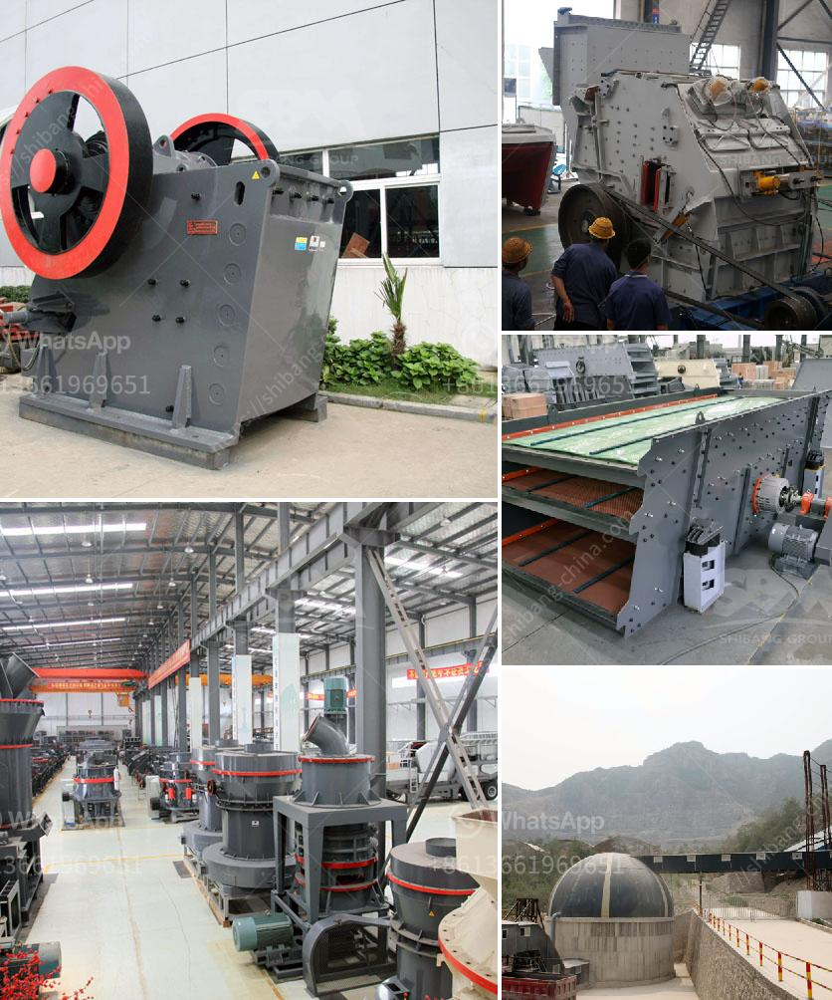

<h3>gypsum factory machines in india</h3>
India is one of the leading producers of gypsum worldwide, and the gypsum industry plays a significant role in the country's infrastructure development. With the increasing demand for gypsum-based products, the need for advanced technology and machinery in the manufacturing process has become crucial. Therefore, the gypsum factory machines in India are constantly evolving to meet the industry's requirements efficiently.

Gypsum is a versatile material widely used in various industries such as construction, agriculture, and even medicine. It is primarily used in the construction sector for producing plasterboards, drywalls, and cement. Additionally, gypsum is a crucial ingredient in agriculture, where it is used as a soil conditioner to improve fertility.

To meet the ever-growing demand for gypsum products, several gypsum factory machines have been developed. These machines have revolutionized the gypsum manufacturing process, making it faster, more efficient, and cost-effective. Let's explore some of the key machines used in gypsum factories in India:

1. Gypsum Powder Making Machine: This machine is used to crush and grind gypsum rocks into a fine powder. It ensures a uniform particle size distribution, which is vital for the quality of gypsum-based products. The gypsum powder making machine typically consists of a jaw crusher, bucket elevator, electromagnetic vibrating feeder, grinding mill, powder concentrator, and pulse dust collector.

2. Gypsum Board Production Line: This machine is responsible for the production of gypsum boards or drywalls. It includes various stages such as mixing the gypsum slurry, forming the board, drying, and finally cutting it into appropriate sizes. Advanced machines in this production line can produce a high volume of gypsum boards with precise dimensions.

3. Gypsum Drying Machine: As the name suggests, this machine is used to remove moisture from the gypsum boards or gypsum powder. It ensures that the final product has the desired strength and stability. The drying process may involve various techniques like forced convection, natural convection, or infrared radiation.

4. Gypsum Block Making Machine: This machine is used to produce solid gypsum blocks, which find applications in building construction. The blocks are typically made by pouring the gypsum slurry into molds and allowing it to harden. The gypsum block making machine ensures accurate molding and excellent strength of the blocks.

5. Gypsum Crushing System: This machine is used to crush raw gypsum rocks into smaller sizes, making it easier to handle during the manufacturing process. It consists of a heavy-duty crusher, conveyor belts, and a vibrating screen. The crushing system enhances the efficiency of the gypsum factory by reducing the material handling time.

In recent years, several Indian machinery manufacturers have introduced innovative and automated gypsum factory machines. These machines come with advanced control systems, allowing operators to monitor and optimize the manufacturing process effectively. Their energy-efficient features reduce production costs and minimize environmental impact.

The growth of the gypsum industry in India heavily relies on the continuous development and utilization of advanced machinery. The government, along with industry players, should promote research and development to enhance the machinery and technology used in gypsum factories. This will contribute to the country's infrastructural growth and overall economic development.

In conclusion, the gypsum factory machines in India are constantly evolving to meet the increasing demand for gypsum-based products. These advanced machines have streamlined the manufacturing process, ensuring high-quality and cost-effective gypsum products. With continuous investments in research and development, India is set to become a global leader in gypsum production.
<h3>Contact us</h3><ul><li><strong>Whatsapp:&nbsp;<a href="https://wa.me/8613661969651">+8613661969651</a></strong></li><li><a href="https://swt.shibang-china.com/?git&amp;zhl&amp;gypsum factory machines in india"><strong>Online Service(chat now)</strong></a></li></ul><h3>Related</h3><ul><li><a href='quarry equipment prices.md'>quarry equipment prices</a></li><li><a href='pe 400 by 600 single toggle jaw crusher specifications.md'>pe 400 by 600 single toggle jaw crusher specifications</a></li><li><a href='belt conveyor system manufacturers.md'>belt conveyor system manufacturers</a></li><li><a href='stone crusher equipments.md'>stone crusher equipments</a></li><li><a href='small cone crushers.md'>small cone crushers</a></li></ul>