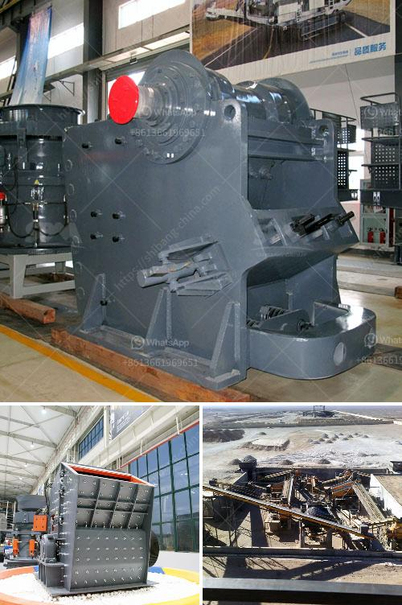

<h3>gypsum granules plant manufacturer in india</h3>
Gypsum granules are a popular soil amendment product used for improving the fertility of the soil. It helps in retaining water, reducing soil erosion, and increasing crop productivity. With the increasing awareness about sustainable agriculture practices and the need for enhancing soil health, the demand for gypsum granules has been rising steadily in India.

To meet this growing demand, several gypsum granules plant manufacturers have emerged in India, offering innovative solutions in gypsum granulation. These manufacturers play a crucial role in supplying high-quality gypsum granules to farmers and agricultural societies across the country.

One such prominent manufacturer in India is ABC Machinery. With years of experience in the industry, ABC Machinery has earned a reputation for producing top-notch gypsum granules plants. They offer a wide range of plant models that can cater to the varying needs of farmers, from small-scale operations to large-scale production.

The plant manufactured by ABC Machinery utilizes advanced technology and equipment for the granulation process. Their plants are designed to provide efficient and consistent granulation, ensuring the uniform size and quality of the gypsum granules. The machines are also easy to operate and maintain, offering convenience and minimizing downtime.

Another leading manufacturer in the industry is Xiangyi Mechanical Co., Ltd. Based in China, they have established a strong presence in India with their high-quality gypsum granulation plants. Xiangyi Mechanical Co., Ltd. specializes in designing and manufacturing gypsum granulation machinery that meets international standards. Their plants are known for their robust construction, excellent performance, and energy efficiency.

Xiangyi Mechanical Co., Ltd. takes pride in their extensive research and development capabilities, continuously improving their plant designs and incorporating advanced features. They also provide comprehensive after-sales support, ensuring customer satisfaction and long-term partnerships.

One of the key factors contributing to the success of gypsum granules plant manufacturers in India is the availability of high-quality gypsum deposits in the country. India has significant reserves of natural gypsum, making it an ideal location for setting up gypsum granulation plants. This ensures a consistent supply of raw material and reduces dependency on imports.

Moreover, the government's focus on promoting sustainable agriculture practices has further boosted the demand for gypsum granules. Various initiatives and subsidies provided by the government encourage farmers to use gypsum granules for improving soil health, thereby increasing crop yield and reducing environmental impact.

In conclusion, gypsum granules plant manufacturers in India are playing a crucial role in meeting the growing demand for gypsum granules in the country. With their advanced technology, high-quality machinery, and focus on customer satisfaction, they are facilitating the adoption of sustainable agricultural practices and contributing to the overall development of the agricultural sector in India. As the demand for gypsum granules continues to rise, these manufacturers are poised for further growth and expansion in the coming years.
<h3>Contact us</h3><ul><li><strong>Whatsapp:&nbsp;<a href="https://wa.me/8613661969651">+8613661969651</a></strong></li><li><a href="https://swt.shibang-china.com/?git&amp;zhl&amp;gypsum granules plant manufacturer in india"><strong>Online Service(chat now)</strong></a></li></ul><h3>Related</h3><ul><li><a href='quarry crusher equipment for sale in usa.md'>quarry crusher equipment for sale in usa</a></li><li><a href='price stone crusher.md'>price stone crusher</a></li><li><a href='ball mill suppliers usa.md'>ball mill suppliers usa</a></li><li><a href='iron processing machine price.md'>iron processing machine price</a></li><li><a href='gold wash plant equipment in ghana.md'>gold wash plant equipment in ghana</a></li></ul>