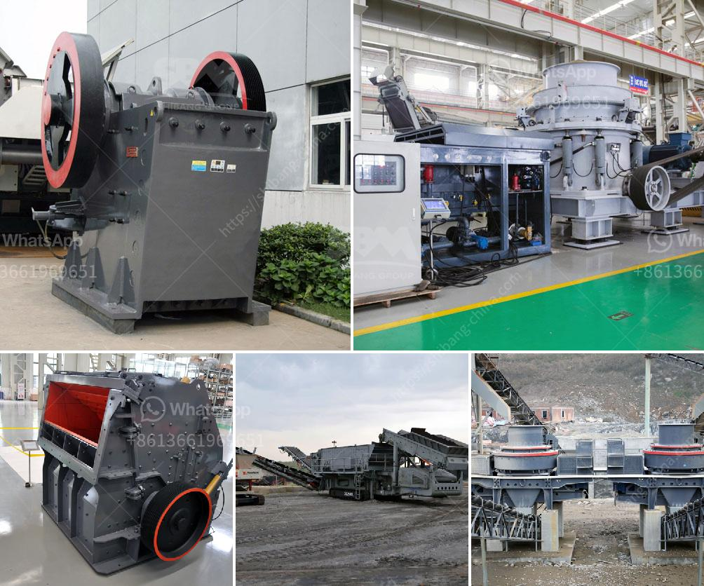

<h3>gypsum grinding machine manufacturer</h3>
Gypsum powder is widely used in the construction, chemical, and agriculture industries. With the increasing demand for gypsum products, manufacturers are in high need of efficient gypsum grinding machines to ensure smooth and productive operations.

As the leading manufacturer in the industry, SBM Machinery understands the importance of providing high-quality equipment to meet the ever-growing demands of customers. Specializing in the production of gypsum grinding machines, SBM Machinery offers a comprehensive range of solutions for gypsum powder production.

One of the key advantages of SBM Machinery's gypsum grinding machines is their high level of precision and durability. The machines are designed to deliver consistent performance, ensuring that the gypsum powder produced meets the required specifications. This is particularly important in industries where the quality of the final product is of utmost importance.

The gypsum grinding machines from SBM Machinery are compact in design, reliable in operation, and easy to maintain. They can be used in both open and closed circuit grinding applications, with the option to carry out multiple grinding stages simultaneously. This makes them highly versatile and suitable for a wide range of applications.

In addition to their high efficiency, SBM Machinery's gypsum grinding machines also offer a number of other advantages. They are equipped with advanced control systems that allow for precise control of the grinding process, ensuring consistent results every time. The machines are also energy efficient, helping to reduce energy consumption and lower operating costs.

SBM Machinery is committed to providing excellent customer service and support. They offer comprehensive training programs for operators and maintenance personnel, ensuring that customers can maximize the performance and lifespan of their equipment. Additionally, they have a team of experienced engineers who are always ready to provide technical assistance and troubleshooting support.

With years of experience in the industry, SBM Machinery has established a solid reputation as a leading gypsum grinding machine manufacturer. Their machines are used by countless manufacturers around the world, and their expertise has made them a trusted partner for many.

Overall, the gypsum grinding machines from SBM Machinery are a reliable choice for manufacturers looking to enhance their production capabilities. Their high precision, durability, and ease of use make them an ideal solution for grinding gypsum powder. With excellent customer service and support, SBM Machinery ensures that customers can achieve maximum productivity and efficiency with their equipment.
<h3>Contact us</h3><ul><li><strong>Whatsapp:&nbsp;<a href="https://wa.me/8613661969651">+8613661969651</a></strong></li><li><a href="https://swt.shibang-china.com/?git&amp;zhl&amp;gypsum grinding machine manufacturer"><strong>Online Service(chat now)</strong></a></li></ul><h3>Related</h3><ul><li><a href='price limestone crusher for sale.md'>price limestone crusher for sale</a></li><li><a href='bentonite production plant machinery.md'>bentonite production plant machinery</a></li><li><a href='rock crusher from china.md'>rock crusher from china</a></li><li><a href='ball mills for cement grinding.md'>ball mills for cement grinding</a></li><li><a href='used crushers in america.md'>used crushers in america</a></li></ul>