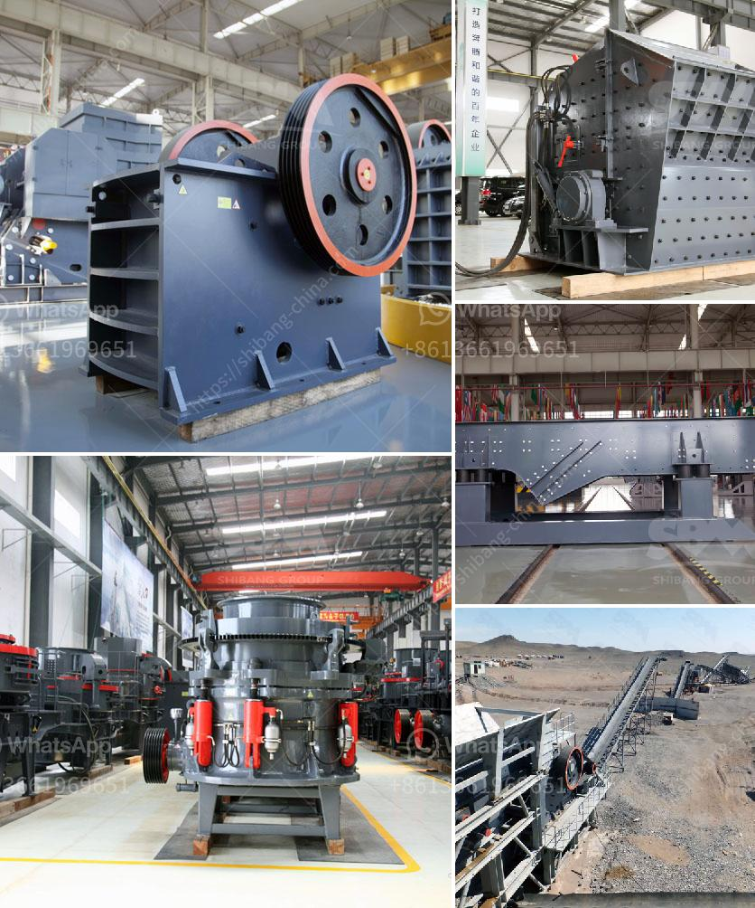

<h3>gypsum manufacturing machine</h3>
Gypsum is a versatile material used across various industries due to its unique properties. It is widely known for its use in the construction industry as a key ingredient in making plaster and drywall. The manufacturing process of gypsum involves extracting the mineral, crushing it, and then heating it to remove any impurities before processing it further into various forms.

One crucial aspect of gypsum manufacturing is the use of specialized machinery that ensures efficiency and quality throughout the process. Gypsum manufacturing machines are designed to handle the entire gypsum production process, from extraction to the final product.

Firstly, the extraction process involves mining gypsum deposits from the earth's crust. This step requires heavy machinery such as excavators and loaders to extract the raw material. Once extracted, the gypsum is transported to the crushing plant where it is reduced to smaller sizes suitable for further processing.

The next step in gypsum manufacturing involves heating the crushed gypsum powder in a calcination kiln. The kiln can reach temperatures between 150 and 180 degrees Celsius, causing the gypsum to lose its water content and transform into a dry, powdery substance known as calcined gypsum.

To ensure high-quality gypsum products, manufacturers employ advanced gypsum manufacturing machines. These machines are designed to control and monitor the calcination process, allowing precise temperature and duration control. This is crucial as any variations in temperature or time can affect the final product's strength and setting properties.

After calcination, the gypsum powder is further processed to obtain the desired product form. This can be achieved through a molding process or by adding certain additives and binders to the powder. Gypsum manufacturing machines play a vital role in this stage, as they are responsible for shaping the gypsum into various forms such as panels, blocks, or plasterboard.

Gypsum board manufacturing machines, for example, are used to produce gypsum panels commonly used in wall and ceiling construction. These machines consist of a conveyor system that transports the calcined gypsum powder between two paper sheets. The paper sheets act as facings, providing strength and durability to the gypsum board.

Moreover, gypsum block manufacturing machines are designed to produce solid gypsum blocks used for partition walls or lightweight construction applications. These machines use a specific mix of gypsum, water, and additives that are poured into molds and solidified under pressure and heat.

To ensure the efficiency and reliability of gypsum manufacturing machines, regular maintenance and servicing are crucial. This includes cleaning and lubricating the moving parts, inspecting electrical systems, and replacing worn-out components. Manufacturers often provide comprehensive maintenance guidelines to ensure machines operate optimally and prevent any interruptions in the production process.

In conclusion, gypsum manufacturing machines are instrumental in the production of high-quality gypsum products. These machines play a pivotal role in various stages, from the extraction and crushing of raw materials to the final shaping and formation of gypsum products. Implementing advanced machinery ensures precise control, efficiency, and consistency in the manufacturing process. Regular maintenance and servicing are vital to prolong the lifespan and performance of gypsum manufacturing machines, ultimately contributing to the production of superior gypsum products in a variety of industries.
<h3>Contact us</h3><ul><li><strong>Whatsapp:&nbsp;<a href="https://wa.me/8613661969651">+8613661969651</a></strong></li><li><a href="https://swt.shibang-china.com/?git&amp;zhl&amp;gypsum manufacturing machine"><strong>Online Service(chat now)</strong></a></li></ul><h3>Related</h3><ul><li><a href='sand sieve machine philippines.md'>sand sieve machine philippines</a></li><li><a href='granite stone crusher india.md'>granite stone crusher india</a></li><li><a href='quarry equipment manufacturer.md'>quarry equipment manufacturer</a></li><li><a href='single super phosphate plants in germany.md'>single super phosphate plants in germany</a></li><li><a href='beneficiation plant for feldspar japan.md'>beneficiation plant for feldspar japan</a></li></ul>