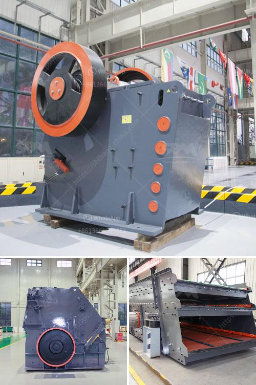

<h3>gypsum powder making germany machinery</h3>
Gypsum is a soft mineral found in the Earth's crust. It is a calcium sulfate dihydrate compound that has many uses in different industries, including construction, agriculture, and chemical. Gypsum powder is a white, smooth powder that is derived from heating gypsum stone. Mined gypsum is crushed, heat-dried, and ground to a fine powder. This powder is then used in various applications, from manufacturing plasterboards to cement production.

Germany, a country renowned for its engineering prowess and technological advancements, is a leading manufacturer of machinery for gypsum powder production. With decades of experience, German manufacturers have developed a variety of advanced machinery used in every stage of gypsum powder manufacturing, including crushing, grinding, calcining, and packaging.

The first step in gypsum powder production is crushing the raw gypsum stone into smaller particles. German crushing machinery uses advanced technology to reduce the gypsum stone to the desired size. This crushed gypsum is then transported to a grinding mill. German grinding machinery utilizes intricate cutting-edge technology, ensuring fine powder production in a reliable and efficient manner.

Once the gypsum is ground into a powder, it undergoes a calcination process in order to remove any water content. German machinery for gypsum calcination ensures precise temperature control throughout the process, resulting in high-quality gypsum powder.

After calcination, the gypsum powder is meticulously packaged using state-of-the-art packaging machinery. German packaging machinery guarantees accurate and efficient packaging, ensuring that the gypsum powder remains in its pristine condition until it reaches the end-user.

German gypsum powder making machinery is widely used in various industries, encompassing construction, agriculture, and chemical. In the construction industry, gypsum powder is primarily used for manufacturing plasterboards, drywall, and false ceilings. German machinery plays a crucial role in producing high-quality plasterboards that are durable, fire-resistant, and provide excellent acoustic insulation.

Gypsum powder also finds application in the agricultural sector. It is used as a soil conditioner to improve soil structure and fertility. German machinery aids in the production of high-quality gypsum powder, ensuring its effectiveness as a soil amendment.

Furthermore, gypsum powder is utilized in the chemical industry, primarily in the production of cement. By adding gypsum powder to cement clinker, the setting time of cement is controlled, ensuring optimal working conditions for construction projects. German machinery for gypsum powder production enables the manufacturing of high-quality cement with precise setting time control.

In conclusion, Germany is a leading manufacturer of machinery for gypsum powder production. With advanced technology and years of experience, German manufacturers have developed state-of-the-art machinery used in every stage of gypsum powder making. From crushing and grinding to calcination and packaging, German machinery ensures high-quality gypsum powder production in various industries. These machines play a crucial role in manufacturing plasterboards, improving soil structure, and producing high-quality cement. With Germany's expertise in engineering and manufacturing, the country continues to be a leader in the gypsum powder industry.
<h3>Contact us</h3><ul><li><strong>Whatsapp:&nbsp;<a href="https://wa.me/8613661969651">+8613661969651</a></strong></li><li><a href="https://swt.shibang-china.com/?git&amp;zhl&amp;gypsum powder making germany machinery"><strong>Online Service(chat now)</strong></a></li></ul><h3>Related</h3><ul><li><a href='raymond mill manufacturer in india.md'>raymond mill manufacturer in india</a></li><li><a href='trading industrial stone crushers.md'>trading industrial stone crushers</a></li><li><a href='standards sizes of conveyor belts.md'>standards sizes of conveyor belts</a></li><li><a href='coal pulverizer price.md'>coal pulverizer price</a></li><li><a href='grinding mill machine kenya.md'>grinding mill machine kenya</a></li></ul>