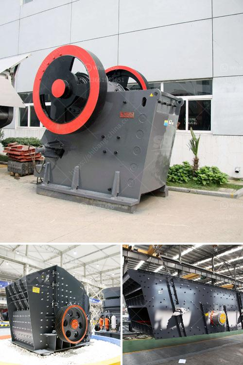

<h3>gypsum powder making machine pdf</h3>
Gypsum powder making machine is commonly known as gypsum powder mill, milling equipment. The gypsum powder production line includes four process flow: crushing, grinding, calcine, storing and feeding. By using loader to feed the gypsum rock to the raw material storage bin. And then it will be transferred to the crusher to be crushed.

Gypsum rocks are crushed into particles less than 30mm by gypsum crusher, and then transported to the gypsum ball mill for grinding. The gypsum powder that reaches the required fineness of the product after being ground is sent to the boiling furnace for calcination by the concentrator. After a certain time, it will be discharged through the discharge valve.

The boiling furnace is widely used in building materials, chemical industry, metallurgy, casting, and other industries. It is mainly used to calcine gypsum, gypsum powder, fly ash, furnace slag, etc. The boiling furnace is equipped with a dust collector to prevent dust pollution in the production process and meet the environmental protection requirements.

The gypsum powder production line is composed of a crusher, a grinding mill, a boiling furnace, a dust collector, and a conveying system. The technology of the equipment is relatively advanced and mature in the domestic market. Compared with other grinding equipment, it has the following advantages:

1. Low energy consumption: the energy consumption of a single unit of the gypsum powder production line is only 30% of the ball mill system.

2. Low investment: the market price of gypsum powder is relatively low, and the investment and production cost of the gypsum powder production line will be relatively low, which is more conducive to the rapid capture and occupy the market share.

3. High precision: the gypsum powder production line uses advance technology, mature and stable process, and advanced equipment to ensure the quality of gypsum powder.

4. Long service life: the internal components of the production line are made of high-quality materials, including the grinding roller, grinding ring, and the housing. Thus, providing a reliable guarantee for the long-term stability of the equipment and reducing maintenance costs.

The gypsum powder production line can process many raw materials, such as gypsum rock, gypsum block, gypsum board, and other gypsum products. By using gypsum powder making machine, the gypsum powder production line can produce high quality gypsum powder. With high performance and the adjustable fineness, the gypsum powder production line can give the gypsum powder hall the advantages like competitive price, low energy consumption, small footprint, easy operation and maintaining, environmental protection and so on.

In conclusion, gypsum powder making machine is a type of commonly used milling equipment. According to different needs and application areas, gypsum powder production line is divided into many types, including gypsum powder making machine pdf, gypsum powder making machine pdf, gypsum powder making machine pdf, gypsum powder making machine pdf, gypsum powder making machine pdf, gypsum powder making machine pdf, etc. With advanced grinding technology, low energy consumption and small footprint, gypsum powder making machine pdf has become the preferred choice for many gypsum powder industry investors.
<h3>Contact us</h3><ul><li><strong>Whatsapp:&nbsp;<a href="https://wa.me/8613661969651">+8613661969651</a></strong></li><li><a href="https://swt.shibang-china.com/?git&amp;zhl&amp;gypsum powder making machine pdf"><strong>Online Service(chat now)</strong></a></li></ul><h3>Related</h3><ul><li><a href='ball mill specification.md'>ball mill specification</a></li><li><a href='harga dan tipe stone crusher indonesia.md'>harga dan tipe stone crusher indonesia</a></li><li><a href='zimbabwe clay brick making machine.md'>zimbabwe clay brick making machine</a></li><li><a href='how to set up a granite quarry crusher.md'>how to set up a granite quarry crusher</a></li><li><a href='kaolin indonesia crusher manufacturer.md'>kaolin indonesia crusher manufacturer</a></li></ul>