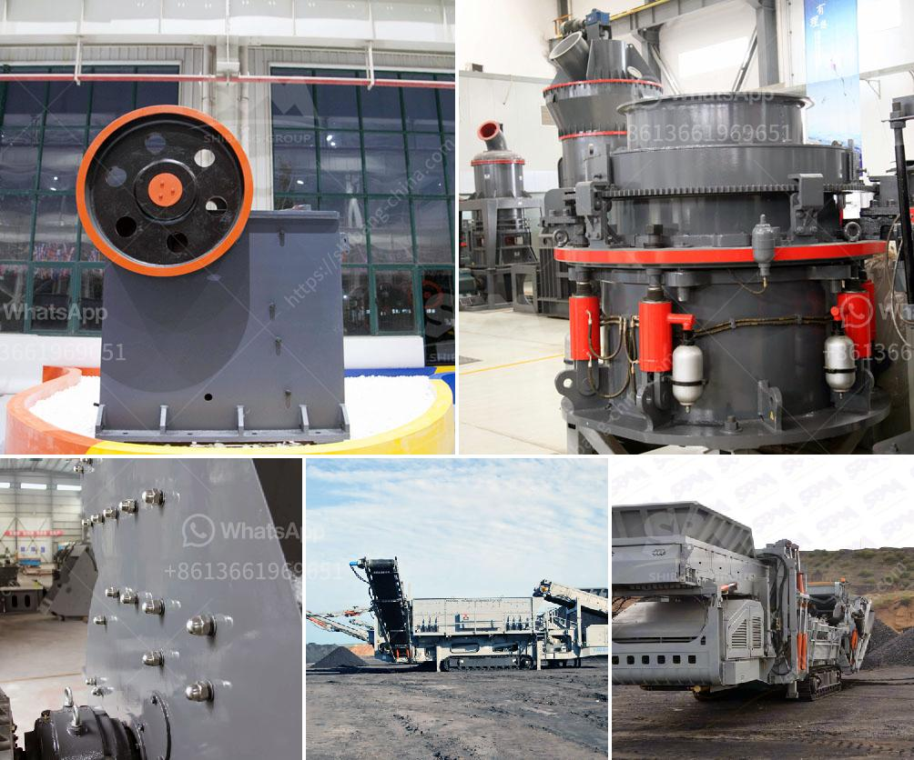

<h3>gypsum powder production line factory</h3>
Gypsum powder production line factory is a highly automated assembly line, specializing in the production of gypsum powder. The core product is gypsum powder, also known as plaster of Paris. It is widely used in numerous industries such as construction, building materials, molds, medical food, chemical, and agriculture.

1.High Efficiency, Under the same finished final size and the same motor power, the capacity of the gypsum powder production line factory is twice as much as airflow mill, mixing mill, and ball mill, and energy consumption decreased 30%.

2.Long lifecycle of spare parts. The ring and roller are forged by special material with high utilization. Under the same grinding material and finish special size, the lifecycle of spare parts is about one year, which is 2-3 times longer than impact mill or turbo mill.

3.Environmental-friendly. The application of pulse bag filter and muffler greatly alleviates dust pollution and noise.

Gypsum powder production line factory has been launched for many years. But the market still has a considerable quantity of gypsum powder that is not fully used. The waste of resources is not only dust and winter pollution. Gypsum powder is usually white, light yellow and light gray, with different colors due to impurities such as water content, clay, and sulfur. It has the characteristics of low calorific value, sulfur content and low volatile content after burning. Gypsum is widely used in the construction industry due to its fire resistance, heat insulation, and sound absorption properties.

In conclusion, the gypsum powder production line factory is a reliable investment choice if you are in the market for gypsum powder. This single investment can meet the needs of various industries and help you gain more wealth in the future.
<h3>Contact us</h3><ul><li><strong>Whatsapp:&nbsp;<a href="https://wa.me/8613661969651">+8613661969651</a></strong></li><li><a href="https://swt.shibang-china.com/?git&amp;zhl&amp;gypsum powder production line factory"><strong>Online Service(chat now)</strong></a></li></ul><h3>Related</h3><ul><li><a href='gypsum crusher in salalah oman.md'>gypsum crusher in salalah oman</a></li><li><a href='pebble crusher for grinding mill.md'>pebble crusher for grinding mill</a></li><li><a href='grinding mill barite.md'>grinding mill barite</a></li><li><a href='used crusher stone sale tanzania.md'>used crusher stone sale tanzania</a></li><li><a href='tph stone crusher.md'>tph stone crusher</a></li></ul>