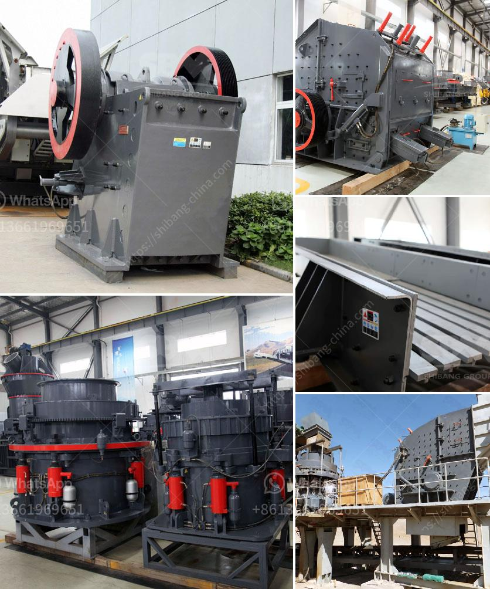

<h3>gypsum powder production line in turkey</h3>
In Turkey, the prospects for further economic development are promising with the construction industry booming. As a result, gypsum powder production line has become an important industry in Turkey.

The Turkish government has invested heavily in infrastructure development over the years. The construction industry has experienced rapid growth, demanding increased supplies of construction materials such as gypsum powder. Gypsum is a key raw material used in the production of plasterboard, drywall, and other construction materials.

Turkey has abundant gypsum reserves, making it an established player in the global gypsum market. In order to meet the increasing demand, Turkish gypsum powder production line manufacturers have expanded their product line and technology to develop gypsum powder production lines with advanced technology and equipment.

One such company is Hengshui Decheng Machinery & Equipment Co., Ltd., a leading manufacturer of gypsum powder production lines in China. They specialize in the production and exportation of gypsum powder production lines and have been supplying their products to customers in Turkey for many years.

Hengshui Decheng Machinery & Equipment Co., Ltd. offers a complete range of gypsum powder production lines with different capacities. Their production lines are designed to produce gypsum powder with a wide range of fineness, from 80 mesh to 325 mesh, satisfying diverse customer requirements.

The production process of their gypsum powder production lines starts with the extraction of gypsum ore, which is crushed and powdered to form a fine powder. The powder is then heated at a controlled temperature to remove any moisture content and improve its quality. Afterward, the gypsum powder is screened and packed, ready for distribution.

Hengshui Decheng Machinery & Equipment Co., Ltd.’s gypsum powder production lines are highly efficient and environmentally friendly. They have incorporated advanced technologies to ensure low energy consumption and minimal waste production. Furthermore, their production lines comply with international quality standards and are CE and ISO9001 certified.

The company offers tailor-made solutions to meet specific customer requirements. They provide technical support and after-sales service, ensuring the smooth operation and maximum performance of their gypsum powder production lines. Their commitment to customer satisfaction has earned them a good reputation in the Turkish market.

The gypsum powder produced by these production lines has a wide range of applications in the construction industry. It is commonly used for plastering walls and ceilings, as well as for creating decorative elements such as cornices and molds. Gypsum powder is also used in cement production, as a soil conditioner, and in the manufacturing of various consumer and industrial products.

In conclusion, the gypsum powder production line industry in Turkey is witnessing substantial growth due to the increasing demand for construction materials. Turkish companies, such as Hengshui Decheng Machinery & Equipment Co., Ltd., are leading the way in terms of production capacity, technology, and product quality. As the construction industry continues to boom, the demand for gypsum powder production lines in Turkey is expected to rise, presenting lucrative opportunities for both domestic and foreign investors.
<h3>Contact us</h3><ul><li><strong>Whatsapp:&nbsp;<a href="https://wa.me/8613661969651">+8613661969651</a></strong></li><li><a href="https://swt.shibang-china.com/?git&amp;zhl&amp;gypsum powder production line in turkey"><strong>Online Service(chat now)</strong></a></li></ul><h3>Related</h3><ul><li><a href='hydraulic jaw crusher.md'>hydraulic jaw crusher</a></li><li><a href='sand making crusher machine.md'>sand making crusher machine</a></li><li><a href='calcium carbonate crushing plant.md'>calcium carbonate crushing plant</a></li><li><a href='ceramic ball mill.md'>ceramic ball mill</a></li><li><a href='concrete crusher made in japan.md'>concrete crusher made in japan</a></li></ul>