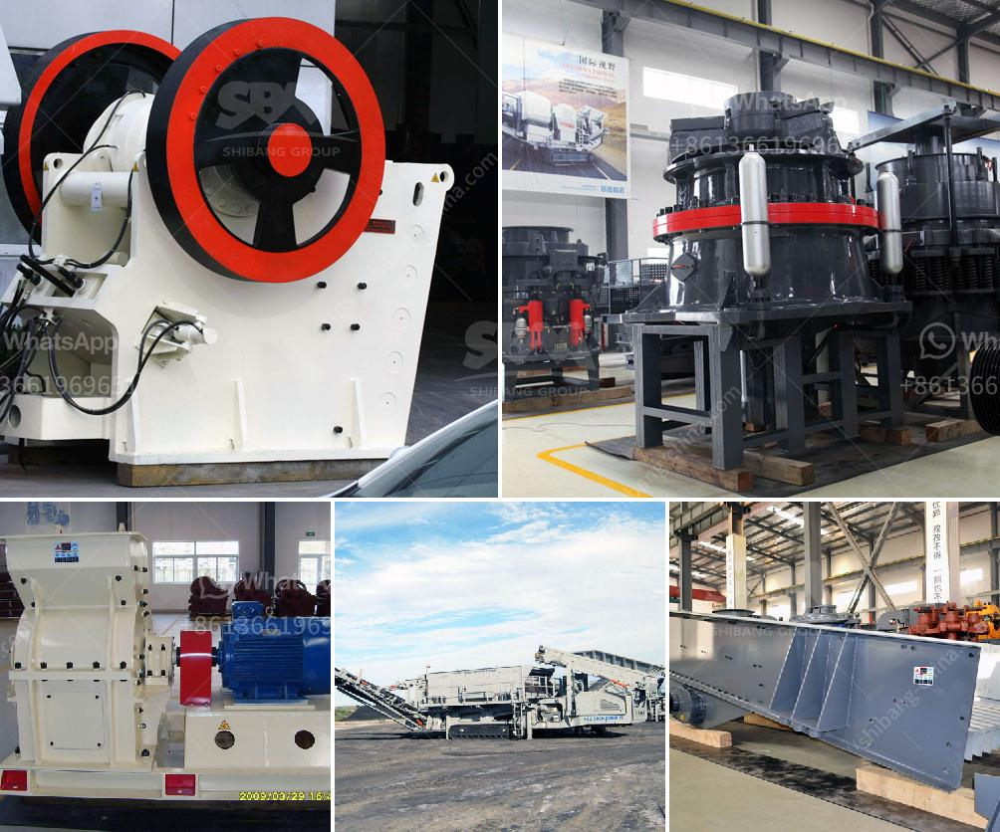

<h3>gypsum powder production plants</h3>
Gypsum powder, also known as calcium sulfate dihydrate, is a versatile and widely used material in various industries, including construction, agriculture, and chemical. Gypsum powder production plants are vital to the industry, as they process a crucial material for many applications.

Gypsum powder is primarily obtained from gypsum ore, which is mined or quarried in various locations around the world. The ore is then crushed and heated at high temperatures to remove any impurities, resulting in a raw material called calcined gypsum. This calcined gypsum is further processed to produce gypsum powder.

Gypsum powder production plants consist of various machinery and equipment, including crushers, mills, conveyors, and dust collectors. They work together to process the raw gypsum into a fine powder that can be used in various applications.

The process begins with the crushing of the raw gypsum ore into smaller particles using crushers or mills. The crushed material is then transported to a mill, where it is ground into a fine powder. The powdered gypsum is then transported to a calciner, where it is heated to remove any remaining moisture and convert it into calcium sulfate hemihydrate, also known as plaster of Paris.

The plaster of Paris is then further ground into a fine powder in a mill, resulting in gypsum powder. This powder can be used in several applications, such as construction materials (e.g., gypsum boards, plaster, and cement), soil amendments in agriculture, and as an additive in various industrial processes, including paper production and paint manufacturing.

Gypsum powder production plants are designed to meet the increasing demand for gypsum powder in various industries. They are typically modern, highly automated facilities that can produce large quantities of gypsum powder efficiently and consistently.

One important aspect of gypsum powder production plants is environmental sustainability. The process generates certain waste materials, such as dust and the removal of by-products like sulfur dioxide. To mitigate their impact on the environment, modern plants utilize dust collectors and emission control systems to capture and treat these by-products effectively.

Moreover, gypsum powder production plants often include recycling systems, where gypsum waste, such as gypsum boards or scraps, can be recycled and reintroduced into the production process. This reduces the need for raw materials and minimizes waste.

In conclusion, gypsum powder production plants play a vital role in processing gypsum ore into a versatile and valuable material for various industries. They employ a range of machinery and equipment to crush, grind, and heat the raw gypsum, resulting in gypsum powder that can be used in construction, agriculture, and chemical applications. With modern technologies and a focus on environmental sustainability, these plants ensure the efficient production of gypsum powder while minimizing waste and environmental impact.
<h3>Contact us</h3><ul><li><strong>Whatsapp:&nbsp;<a href="https://wa.me/8613661969651">+8613661969651</a></strong></li><li><a href="https://swt.shibang-china.com/?git&amp;zhl&amp;gypsum powder production plants"><strong>Online Service(chat now)</strong></a></li></ul><h3>Related</h3><ul><li><a href='cost estimates of a chrome processing plant.md'>cost estimates of a chrome processing plant</a></li><li><a href='crusher for silica.md'>crusher for silica</a></li><li><a href='gravel crusher machine philippines.md'>gravel crusher machine philippines</a></li><li><a href='gold processing equipment for sale in zimbabwe.md'>gold processing equipment for sale in zimbabwe</a></li><li><a href='feldspar grinding machine chennai suppliers.md'>feldspar grinding machine chennai suppliers</a></li></ul>