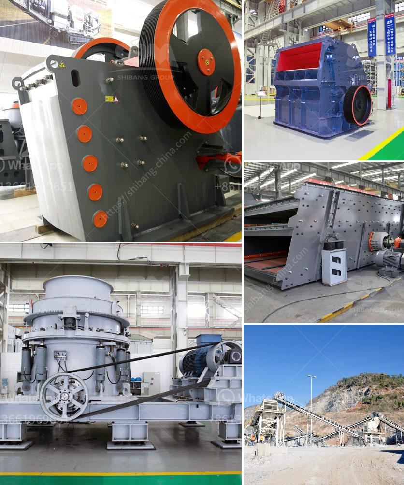

<h3>gypsum recycling equipment for sale</h3>
With the increasing emphasis on sustainable development and waste management, there is a growing demand for efficient solutions to recycle construction waste. One such solution is gypsum recycling, which offers a sustainable way to handle gypsum waste generated during construction and demolition activities. Gypsum recycling equipment for sale is becoming popular in the construction industry, giving contractors and waste management companies an opportunity to contribute to a circular economy.

Gypsum, a commonly used building material, is found in drywall, plaster, and even some types of concrete. However, when these materials are disposed of in landfills, they can release harmful pollutants into the environment. This poses a significant environmental challenge, as landfills are already burdened with tons of waste that takes centuries to decompose. To address this issue, the recycling of gypsum waste has gained traction in recent years.

Gypsum recycling equipment is designed to process gypsum waste into reusable materials such as gypsum powder or recycled gypsum boards. The equipment typically consists of a gypsum shredder, a magnetic separator, and a screen. By shredding the gypsum waste, the equipment reduces its size and removes any contaminants. The magnetic separator then separates any metal particles, while the screen separates the shredded gypsum into different particle sizes.

The resulting gypsum powder can be used for various purposes, including the creation of new gypsum boards, as a soil amendment, or as an additive in cement production. Recycled gypsum boards can be used in interior walls and ceilings, reducing the need for virgin gypsum resources. Moreover, gypsum recycling equipment provides contractors and waste management companies with an additional revenue stream, as they can sell the recycled materials to manufacturers who require them.

Investing in gypsum recycling equipment for sale not only benefits the environment but also enables contractors to adopt a sustainable approach to construction waste management. By recycling gypsum waste, contractors minimize their environmental impact and avoid potential fines associated with improper waste disposal. Additionally, using recycled gypsum materials can contribute to achieving green building certification, such as LEED (Leadership in Energy and Environmental Design).

In conclusion, gypsum recycling equipment for sale offers a sustainable solution to handle gypsum waste generated during construction and demolition activities. Recycling gypsum waste reduces the environmental impact of landfill disposal and provides a valuable resource for manufacturers. By investing in this equipment, contractors and waste management companies can contribute to a circular economy and meet the growing demand for sustainable waste management solutions. Ultimately, gypsum recycling plays a crucial role in achieving a more sustainable and environmentally friendly construction industry.
<h3>Contact us</h3><ul><li><strong>Whatsapp:&nbsp;<a href="https://wa.me/8613661969651">+8613661969651</a></strong></li><li><a href="https://swt.shibang-china.com/?git&amp;zhl&amp;gypsum recycling equipment for sale"><strong>Online Service(chat now)</strong></a></li></ul><h3>Related</h3><ul><li><a href='continuous ball mill for sale in malaysia.md'>continuous ball mill for sale in malaysia</a></li><li><a href='aggregates crushing flow chart process.md'>aggregates crushing flow chart process</a></li><li><a href='grinding plant supplier.md'>grinding plant supplier</a></li><li><a href='gravel crushing plant.md'>gravel crushing plant</a></li><li><a href='small diesel engine jaw crusher.md'>small diesel engine jaw crusher</a></li></ul>