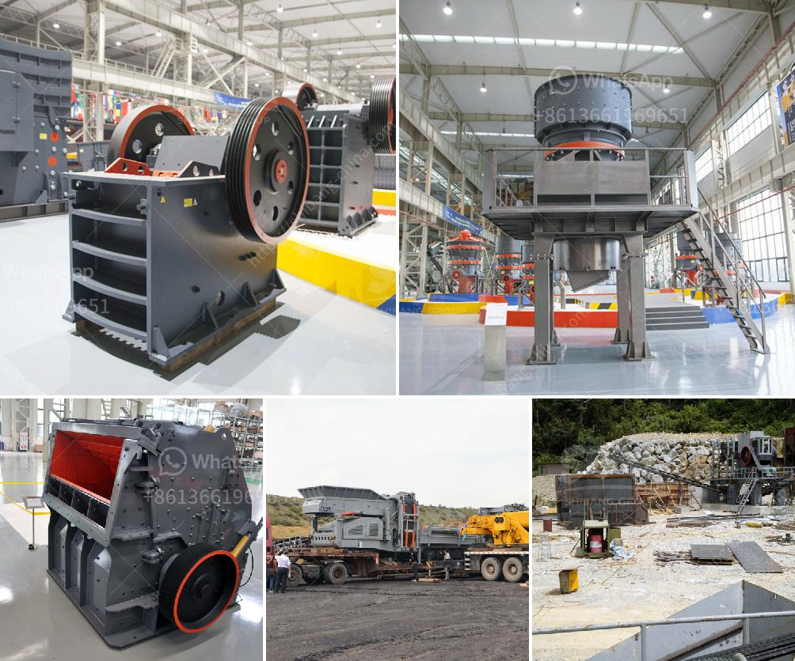

<h3>gypsum recycling machines for sale</h3>
In today's world, where sustainability and waste reduction are paramount concerns, finding innovative solutions for recycling and reusing various materials has become a necessity. One such material that holds great potential for recycling is gypsum. Gypsum is a widely used construction material, typically found in drywall and plasterboard. The production and disposal of gypsum waste pose significant environmental and economic challenges. However, with the advent of advanced gypsum recycling machines, a sustainable solution for gypsum waste management is now available.

Gypsum waste is a byproduct of construction, demolition, and renovation projects. Traditional disposal methods, such as landfilling, have been the go-to option for dealing with this waste. However, this approach is not sustainable in the long run. Landfill sites are rapidly filling up, and the hazardous compounds present in gypsum waste can leach into the soil and groundwater, causing environmental pollution.

The introduction of gypsum recycling machines has revolutionized the way gypsum waste is handled. These machines are specifically designed to recycle gypsum waste by separating the gypsum from the paper backing, contaminant-free. The separated gypsum can then be transformed into new gypsum products or used as a raw material in various industries. This process not only reduces the environmental impact of gypsum waste but also provides a viable alternative to virgin gypsum production, which requires extensive mining and energy consumption.

There are several types of gypsum recycling machines available in the market. Some models are portable, allowing for easy transportation and on-site recycling. These machines are suitable for small to medium-scale construction projects, where the generation of gypsum waste is moderate. Other models are larger and more powerful, capable of handling high volumes of gypsum waste, making them ideal for large-scale construction and demolition projects.

One of the key advantages of gypsum recycling machines is their efficiency and cost-effectiveness. By recycling gypsum waste, construction companies can significantly reduce disposal costs, as landfilling fees can be quite steep. The recycled gypsum can also be sold to manufacturers who produce new gypsum products, generating additional revenue for the recycling company. Moreover, by using recycled gypsum in place of virgin gypsum, industries can reduce their carbon emissions and natural resource consumption, contributing to a more sustainable future.

In conclusion, gypsum recycling machines have emerged as an innovative and sustainable solution for managing and reducing gypsum waste. These machines enable the recycling of gypsum waste into valuable raw materials, minimizing the environmental impact and promoting a circular economy. With increasing awareness about sustainability, the demand for gypsum recycling machines is on the rise. By investing in these machines, construction companies, recycling facilities, and industries can actively contribute to waste reduction and resource conservation, ensuring a greener and more sustainable future for generations to come.
<h3>Contact us</h3><ul><li><strong>Whatsapp:&nbsp;<a href="https://wa.me/8613661969651">+8613661969651</a></strong></li><li><a href="https://swt.shibang-china.com/?git&amp;zhl&amp;gypsum recycling machines for sale"><strong>Online Service(chat now)</strong></a></li></ul><h3>Related</h3><ul><li><a href='crusher price jaw crusher prices.md'>crusher price jaw crusher prices</a></li><li><a href='india gold processing plant apr.md'>india gold processing plant apr</a></li><li><a href='quarry crusher equipment for sale in usa.md'>quarry crusher equipment for sale in usa</a></li><li><a href='grinding of limestone mill grinding.md'>grinding of limestone mill grinding</a></li><li><a href='ball mills for cement grinding.md'>ball mills for cement grinding</a></li></ul>