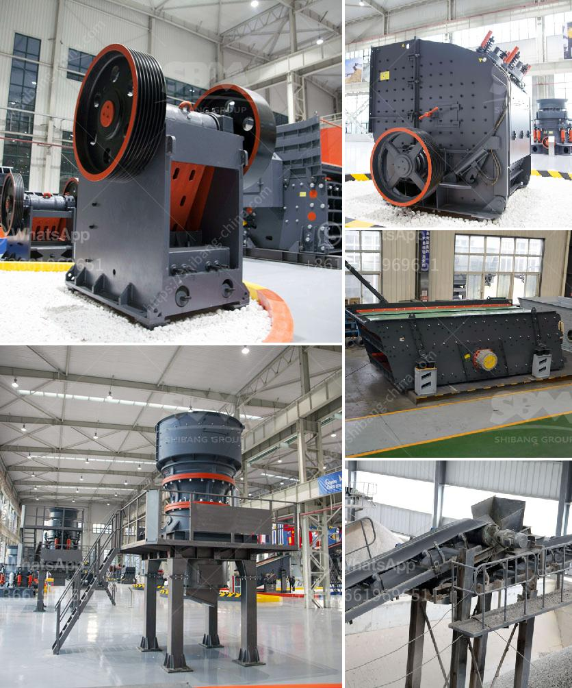

<h3>gypsum recycling plant</h3>
The issue of waste management is a growing concern in today's world. As the population continues to increase, so does the amount of waste generated each day. It is essential to find sustainable solutions that not only reduce waste but also turn it into valuable resources. One such solution is the development of gypsum recycling plants.

Gypsum, a common construction material, is widely used for its fire-resistant and soundproofing properties. However, after its useful life in construction projects, gypsum waste ends up in landfills, contributing to environmental pollution. This is where gypsum recycling plants come into play, transforming waste into a valuable resource.

Gypsum recycling plants operate by collecting waste gypsum from construction sites and other sources. The waste is then processed and transformed into high-quality gypsum powder, which can be used in multiple applications. These plants utilize advanced technologies to remove impurities and ensure the production of pure gypsum powder.

One primary advantage of gypsum recycling plants is their positive environmental impact. By recycling gypsum waste, these plants help reduce the need for mining natural gypsum, conserving valuable natural resources. Moreover, recycling gypsum waste helps to divert waste from landfills, reducing the strain on already limited landfill space.

Additionally, the recycled gypsum powder produced by these plants offers numerous benefits. It can be used as a raw material in the manufacturing of cement, drywall, and other construction materials. The gypsum powder can also be utilized in agricultural applications, improving soil conditions and promoting crop growth. These multiple usage options make recycled gypsum an attractive alternative to using new raw gypsum material.

Furthermore, the establishment of gypsum recycling plants can create job opportunities and contribute to the local economy. These plants require skilled professionals to operate and maintain the machinery and equipment involved in the recycling process. By providing employment, they not only contribute to the community but also promote sustainable development.

In conclusion, gypsum recycling plants play a significant role in waste management and resource preservation. By recycling gypsum waste and transforming it into valuable gypsum powder, these plants contribute to environmental sustainability, reduce reliance on natural resources, and provide multiple economic benefits. It is crucial to encourage and support the development of more gypsum recycling plants to maximize waste reduction and resource utilization.
<h3>Contact us</h3><ul><li><strong>Whatsapp:&nbsp;<a href="https://wa.me/8613661969651">+8613661969651</a></strong></li><li><a href="https://swt.shibang-china.com/?git&amp;zhl&amp;gypsum recycling plant"><strong>Online Service(chat now)</strong></a></li></ul><h3>Related</h3><ul><li><a href='grinding mills jalandhar.md'>grinding mills jalandhar</a></li><li><a href='enquiry impact crusher.md'>enquiry impact crusher</a></li><li><a href='gold processing mill for sale.md'>gold processing mill for sale</a></li><li><a href='calcium carbonate grinding industries in india.md'>calcium carbonate grinding industries in india</a></li><li><a href='gypsum recycling machines for sale.md'>gypsum recycling machines for sale</a></li></ul>