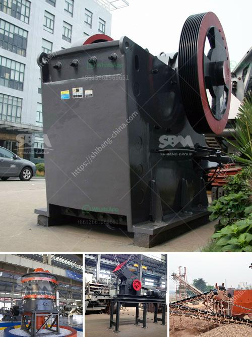

<h3>gyratory crusher advantages and disadvantages</h3>
Gyratory crushers are known for their high production rates, with a higher capacity than a jaw crusher. In order to get cubic particles out of gyratory crusher, the discharge setting must be adjusted continuously. These gyratory crushers have been operating successfully in some of the world's harshest conditions for many years. This type of crusher provides excellent reliability and produces a high crushing ratio, making it an ideal choice for a wide range of applications.

One of the key advantages of the gyratory crusher is that it is built in a way that allows it to handle a high capacity of feed particles. It is ideal for projects requiring a high level of production without compromising on quality.

The gyratory crusher has a large feed opening, which allows it to handle larger quantities of feed material compared to other crushers. It also has a continuous feed system, which ensures a steady supply of material to the crusher.

Another advantage of the gyratory crusher is that it can be equipped with automatic setting regulation technology. This allows for greater control of the crusher and a more consistent product size. It also helps to reduce downtime and increase operational efficiency.

The gyratory crusher has been used in major industrial sectors such as mining, cement, and aggregate production for decades. However, the crusher has its disadvantages as well.

One of the major problems with gyratory crushers is the cumulative wear that occurs over time. This wear can eventually lead to a loss of productivity and unwanted downtime. Additionally, gyratory crushers tend to be more expensive compared to jaw crushers.

Although there are other types of crushers, advantages and disadvantages of gyratory crushers are unique for various reasons. One key advantage is providing greater carrying capacity compared to other crushers. Additionally, the gyratory crusher has a relatively high output rate, which makes it ideal for large-scale operations.

Another benefit of gyratory crushers is that they are designed to handle both hard and soft rock. This versatility makes them appropriate for a wide range of industries and applications. Whether it's mining, construction, or aggregate production, the gyratory crusher can handle it all.

In summary, the advantages of the gyratory crusher include its capacity to handle high production rates, the continuous feed system, and automatic setting regulation. It is also versatile enough to handle various types of rock and has a long lifespan.

On the other hand, some disadvantages of the gyratory crusher include its expensive price, cumulative wear, and potential for unplanned downtime. These factors should be considered when choosing the appropriate crusher for a specific project.

Ultimately, the decision to use a gyratory crusher should be based on a thorough evaluation of the specific requirements and operational needs of the project. It is important to consider both the advantages and disadvantages to make an informed decision.
<h3>Contact us</h3><ul><li><strong>Whatsapp:&nbsp;<a href="https://wa.me/8613661969651">+8613661969651</a></strong></li><li><a href="https://swt.shibang-china.com/?git&amp;zhl&amp;gyratory crusher advantages and disadvantages"><strong>Online Service(chat now)</strong></a></li></ul><h3>Related</h3><ul><li><a href='crusher corpses crusher company.md'>crusher corpses crusher company</a></li><li><a href='graphite mining india.md'>graphite mining india</a></li><li><a href='stone crusher accounting in tally.md'>stone crusher accounting in tally</a></li><li><a href='small scale gypsum powder plant.md'>small scale gypsum powder plant</a></li><li><a href='mining process for perlite.md'>mining process for perlite</a></li></ul>