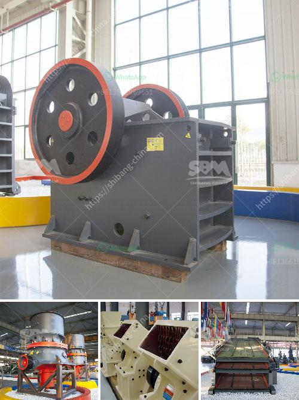

<h3>hammer crusher micron size product</h3>
Hammer crusher, also known as hammer mill, is a type of crusher that is used in various industries for crushing materials into smaller pieces. It is widely used in mining, cement, manufacturing, chemical, and metallurgy industries. In this article, we will discuss the micron size product of hammer crusher and the advantages and challenges associated with it.

The micron size product of hammer crusher refers to the crushed material with particle size smaller than 1000 microns (1 millimeter) in diameter. This finely crushed material is commonly used in various applications that require a fine or ultra-fine powder, such as cement production, pharmaceutical manufacturing, and chemical synthesis.

One of the key advantages of producing a micron size product with a hammer crusher is its versatility. Hammer crushers can be easily adjusted to produce different particle sizes by changing the gap between the hammer and the screen. This flexibility allows the crusher to handle a wide range of materials and produce various sizes of products, making it suitable for different industries and applications.

Furthermore, the production of a micron size product with a hammer crusher offers several benefits. One of them is improved material handling. Fine or ultra-fine powders are usually easier to handle and transport compared to larger particles. This can save time and resources, especially in industries where the material needs to be transported over long distances or in large quantities.

Another advantage of a micron size product is its increased surface area. The fine particles have a larger surface-to-volume ratio, which can enhance various processes like chemical reactions and dissolution rates. This makes micron-sized materials ideal for applications such as drug delivery systems, where a higher surface area can improve the effectiveness of the medication.

However, producing a micron size product with a hammer crusher also presents some challenges. One of the main challenges is achieving a consistent particle size distribution. The size reduction process involves complex interactions between the hammer, the screen, and the material being crushed. Obtaining a narrow particle size distribution can be difficult and may require careful adjustment and monitoring.

Another challenge is the occurrence of over-grinding or excessive particle size reduction. Fine grinding can lead to increased energy consumption, increased wear on the crusher components, and the production of unwanted fines or dust. Proper control and optimization of the hammer crusher operation are necessary to minimize these issues and achieve a desired micron size product.

In conclusion, producing a micron size product with a hammer crusher offers numerous advantages, such as improved material handling, increased surface area, and versatility. However, it also presents challenges in achieving a consistent particle size distribution and avoiding over-grinding. Therefore, careful control and optimization of the crusher operation are essential. With proper management, hammer crushers can be effective tools for producing micron-sized products that meet various industry requirements.
<h3>Contact us</h3><ul><li><strong>Whatsapp:&nbsp;<a href="https://wa.me/8613661969651">+8613661969651</a></strong></li><li><a href="https://swt.shibang-china.com/?git&amp;zhl&amp;hammer crusher micron size product"><strong>Online Service(chat now)</strong></a></li></ul><h3>Related</h3><ul><li><a href='gold wash plant equipment in ghana.md'>gold wash plant equipment in ghana</a></li><li><a href='typical particle size of roll crusher.md'>typical particle size of roll crusher</a></li><li><a href='best stone crushers india.md'>best stone crushers india</a></li><li><a href='multi hammer crusher.md'>multi hammer crusher</a></li><li><a href='pebble crusher for grinding mill.md'>pebble crusher for grinding mill</a></li></ul>