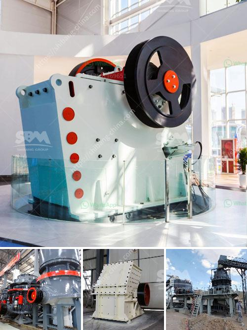

<h3>hammer grinder machine price</h3>
When it comes to choosing the right machine for grinding and crushing materials, many industries and individuals tend to opt for a hammer grinder machine. These machines are known for their versatility, efficiency, and durability. However, one crucial aspect that needs consideration is the price of the hammer grinder machine.

The price of a hammer grinder machine can vary significantly, depending on various factors such as the brand, model, capacity, and features. Generally, the prices start from around $1000 and can go up to several thousand dollars. However, it is important to note that investing in a high-quality and reliable machine is essential, as it ensures long-term productivity and reduces the risk of frequent breakdowns.

One of the primary factors that affect the price of a hammer grinder machine is its capacity. The capacity determines the amount of material that can be processed within a specific period. Machines with higher capacities generally have a higher price tag due to their ability to handle large volumes of materials. On the other hand, smaller capacity machines are cheaper but may not be suitable for industrial-scale operations.

The brand and model of the machine are also significant determinants of the price. Established and reputable brands often offer machines with better performance, higher efficiency, and longer lifespan. Consequently, their prices tend to be higher compared to lesser-known brands. It is advisable to opt for trusted brands that have a proven track record for delivering quality products and excellent after-sales service.

The features and specifications of a hammer grinder machine also contribute to its price. Some machines come with additional features such as dust collectors, automated feeding systems, or specific safety features. These advanced features enhance the performance and safety of the machine but may add to the overall cost. Buyers should carefully evaluate their requirements and prioritize the features that are essential for their specific applications.

Furthermore, the availability and demand for the machine in the market can also affect its price. If a particular model is in high demand or supply is limited, its price may be higher than similar machines. Potential buyers should research and compare prices from different suppliers or manufacturers to ensure they are getting the best value for their investment.

Considering the importance of the hammer grinder machine in many industries, it is crucial to make a well-informed decision while buying one. It is recommended to consult experts or professionals who can provide guidance based on specific requirements and budgets. Additionally, reading customer reviews and testimonials can give valuable insights into the machine's performance and durability.

In conclusion, the price of a hammer grinder machine depends on several factors, including capacity, brand, model, features, and market demand. While it is tempting to opt for cheaper alternatives, investing in a high-quality machine is crucial for long-term productivity and reliability. By carefully assessing requirements, comparing prices, and seeking expert advice, buyers can find the right hammer grinder machine that meets their needs within their budget.
<h3>Contact us</h3><ul><li><strong>Whatsapp:&nbsp;<a href="https://wa.me/8613661969651">+8613661969651</a></strong></li><li><a href="https://swt.shibang-china.com/?git&amp;zhl&amp;hammer grinder machine price"><strong>Online Service(chat now)</strong></a></li></ul><h3>Related</h3><ul><li><a href='vibrating feeder suppliers in the philippines.md'>vibrating feeder suppliers in the philippines</a></li><li><a href='china grinding unit.md'>china grinding unit</a></li><li><a href='talc production line.md'>talc production line</a></li><li><a href='granite crusher factory.md'>granite crusher factory</a></li><li><a href='stone crushers suppliers.md'>stone crushers suppliers</a></li></ul>