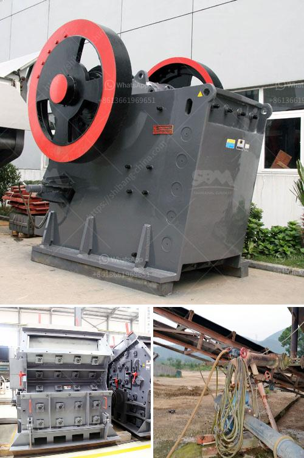

<h3>hammer grinding mill crusher 10tonnes per hour</h3>
The hammer grinding mill crusher, also known as the hammer mill, is an efficient machine for grinding various materials into fine powder. This equipment is widely used in many industrial and mining operations because of its high production capacity and relatively low energy consumption.

With its robust design and simplified maintenance, the hammer grinding mill crusher can process a wide range of materials, including grains, wood chips, straw, grasses, and even certain minerals. It operates by feeding the material into the crushing chamber, where rotating hammers impact and grind it into smaller particles.

One of the key advantages of the hammer grinding mill crusher is its high production capacity. With an output of up to 10 tonnes per hour, it can handle large quantities of material in a relatively short timeframe, making it suitable for industrial-scale operations. This high capacity is achieved through the use of multiple hammers that continuously strike and grind the material until it reaches the desired size.

In addition to its high productivity, the hammer grinding mill crusher is also known for its versatility. It can be easily adjusted to produce different particle sizes by simply changing the screen size. This allows operators to produce various sizes of materials for different applications, such as animal feed, biomass fuel, or even chemicals.

Furthermore, the hammer grinding mill crusher is designed with operator safety in mind. It features a durable housing that contains the rotating hammers, preventing any accidental contact with moving parts. The machine also includes safety mechanisms to ensure its smooth operation and to prevent any potential hazards.

Another notable feature of the hammer grinding mill crusher is its relatively low energy consumption. It is designed to optimize the crushing process, requiring minimal power input while achieving efficient grinding. This helps reduce operating costs, making it an economical choice for businesses looking to save on energy expenses.

Maintenance is key to ensuring the longevity and optimal performance of the hammer grinding mill crusher. Fortunately, this machine is designed to be easily serviced and maintained. Its durable construction and simple design enable quick access to hammers, screens, and other components for inspection and replacement.

In conclusion, the hammer grinding mill crusher is a reliable and versatile machine that offers high production capacity, low energy consumption, and easy maintenance. With its ability to process various materials and produce different particle sizes, it has become a crucial tool in many industrial and mining operations. Whether it's grinding grains for animal feed or pulverizing wood chips for biomass fuel, this equipment delivers efficient and cost-effective results.
<h3>Contact us</h3><ul><li><strong>Whatsapp:&nbsp;<a href="https://wa.me/8613661969651">+8613661969651</a></strong></li><li><a href="https://swt.shibang-china.com/?git&amp;zhl&amp;hammer grinding mill crusher 10tonnes per hour"><strong>Online Service(chat now)</strong></a></li></ul><h3>Related</h3><ul><li><a href='50tpd slag cement grinding unit cost.md'>50tpd slag cement grinding unit cost</a></li><li><a href='sand dryer machine italy.md'>sand dryer machine italy</a></li><li><a href='sand making crusher machine.md'>sand making crusher machine</a></li><li><a href='artificial sand machine.md'>artificial sand machine</a></li><li><a href='typical 100tph jaw crusher feed size.md'>typical 100tph jaw crusher feed size</a></li></ul>