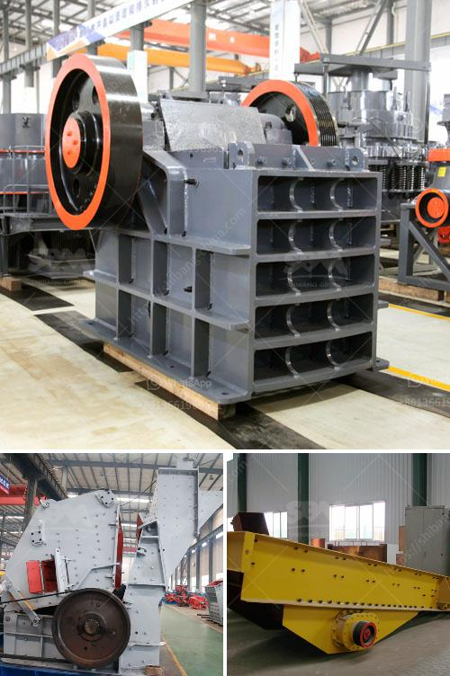

<h3>hammer mill and ball mill</h3>
When deciding between the hammer mill and ball mill, both of which have a rich history, it’s essential to consider their respective pros and cons. Hammer mills are used for squeezing the material into fine particles. Due to its versatility, they are often used in various industries, including mining, agriculture, and pharmaceuticals. On the other hand, ball mills are used for reducing the size of bulk materials to a consistent operational size. They can typically be found in research facilities and mineral processing industries.

Hammer mills consist of a series of hammers mounted on a rotating shaft within a cylindrical chamber. Materials are fed into the mill and are impacted or shattered by the repeated hammer strikes. Once broken, the particles pass through perforated screens, ensuring only the desired size particles are discharged. The mill is fed by a hopper, typically with gravity or a conveyor belt system. This ensures continuous operation.

In contrast, ball mills consist of a rotating horizontal cylinder, partially filled with steel balls. The material is added to the cylinder and the grinding balls then lift and fall, impacting and grinding the ore fragments until they reach the desired size. The finished product is discharged through a grid-like screen to control the particle size.

Hammer mills excel at grinding, crushing, and pulverizing materials with a wide variety of hardness scores, especially those with low fines content. While ball mills are suitable for larger-sized particles, they achieve their final product size through attrition or crushing. The use of balls allows them to reach a higher level of fineness than hammer mills, which are limited to 5–20 microns.

However, the use of hammer mills in high-volume production runs can quickly become costly due to the mill’s low efficiency and explosive possibilities. In addition, hammer mills can only handle relatively low moisture materials, while ball mills are more effective with moisture levels of 7% or higher.

When comparing the two mills, it’s crucial to consider the specific requirements of your application. If your goal is to produce fine particles, consistent in size and narrow in distribution, a ball mill with classifier is the best option. In contrast, a hammer mill is suited for low-volume, high-throughput jobs. Often, the hammer mill is less efficient, causing higher capital costs, slower maintenance and repair, and higher energy consumption.

In summary, hammer mills and ball mills are distinctively different machines that can bring considerable benefits and drawbacks to the pharmaceutical and material processing industries. Thus, understanding their respective advantages and disadvantages is vital before making a selection. While both mills serve different purposes, they can be equally effective, given the appropriate circumstances.
<h3>Contact us</h3><ul><li><strong>Whatsapp:&nbsp;<a href="https://wa.me/8613661969651">+8613661969651</a></strong></li><li><a href="https://swt.shibang-china.com/?git&amp;zhl&amp;hammer mill and ball mill"><strong>Online Service(chat now)</strong></a></li></ul><h3>Related</h3><ul><li><a href='calcium calcium carbonate plants calcium.md'>calcium calcium carbonate plants calcium</a></li><li><a href='ball mill specification.md'>ball mill specification</a></li><li><a href='how to make a roller mill.md'>how to make a roller mill</a></li><li><a href='stone crushing plant in saudi.md'>stone crushing plant in saudi</a></li><li><a href='quartz silica crushing unit.md'>quartz silica crushing unit</a></li></ul>