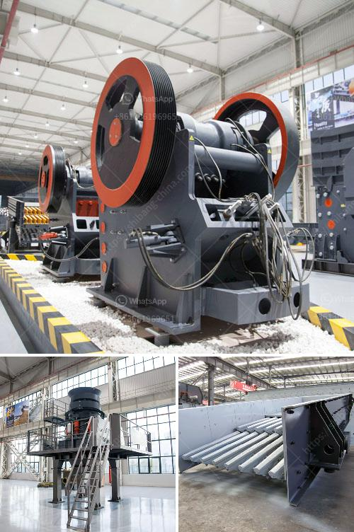

<h3>hammer mill and impactors unit</h3>
Hammer mills and impactors are versatile crushing units used to reduce the size of materials such as limestone, coal, and other similar materials. These machines are widely used in various industries, including mining, cement, construction, and more. In this article, we will explore the features, advantages, and applications of hammer mills and impactors.

A hammer mill is a type of crusher that utilizes high-speed rotating hammers to crush materials into smaller pieces. It works on the principle of impact and attrition: size reduction occurs when the material is repeatedly hit by the hammers until it is small enough to pass through a perforated screen. The perforated screen determines the desired particle size, allowing the operator to control the final product's size distribution.

Hammer mills are known for their robust construction and ability to handle a wide range of materials. They can be used to crush both brittle and non-brittle materials, making them suitable for various applications. Some common examples include crushing coal for power generation, reducing limestone for cement production, and shredding wood for biomass fuel.

One of the key advantages of hammer mills is their high throughput capacity. These machines can handle large quantities of material, making them ideal for processing bulk materials in industrial settings. Additionally, hammer mills are relatively simple to operate and maintain, requiring minimal training and expertise.

Impactors, on the other hand, are similar to hammer mills but operate at higher speeds. They use high-velocity impact forces to shatter the material rather than relying solely on impact and attrition. Impactors are often used when a finer product is desired, as they can produce more consistent and uniform particles.

Impactors are designed with a horizontal shaft and utilize rapidly rotating bars or hammers to strike the material. As the material enters the crushing chamber, it is subjected to intense impact forces, resulting in size reduction. The adjustable gap between the bars or hammers allows for precise control over the final product's size and shape.

One advantage of impactors is their ability to produce a wide range of particle sizes. By adjusting the speed and gap settings, operators can achieve the desired size distribution for their specific application. Impactors are commonly used in the mining industry for primary and secondary crushing, as well as in recycling operations to process concrete and asphalt.

In conclusion, both hammer mills and impactors are essential crushing units used in various industries to reduce the size of materials. Hammer mills are known for their high throughput capacity and versatility, making them suitable for a wide range of applications. In contrast, impactors provide finer particle size control and are often used when a more uniform product is desired. Understanding the differences and advantages of each unit can help industries choose the most appropriate crushing solution for their specific needs.
<h3>Contact us</h3><ul><li><strong>Whatsapp:&nbsp;<a href="https://wa.me/8613661969651">+8613661969651</a></strong></li><li><a href="https://swt.shibang-china.com/?git&amp;zhl&amp;hammer mill and impactors unit"><strong>Online Service(chat now)</strong></a></li></ul><h3>Related</h3><ul><li><a href='stone crusher for sale kenya.md'>stone crusher for sale kenya</a></li><li><a href='price of grinding mills in uganda.md'>price of grinding mills in uganda</a></li><li><a href='hammer mill supplier in pretoria.md'>hammer mill supplier in pretoria</a></li><li><a href='hammer mill south africa.md'>hammer mill south africa</a></li><li><a href='construction of jaw crusher.md'>construction of jaw crusher</a></li></ul>