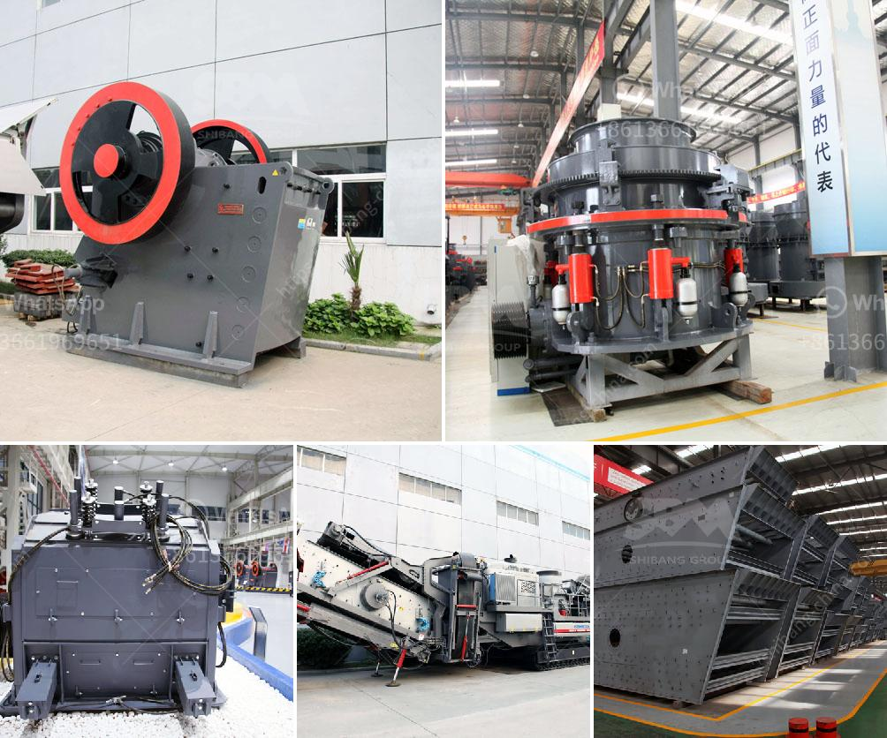

<h3>hammer mill bison price</h3>
The hammer mill bison is a highly versatile machine that can be used for grinding various types of materials. Whether you need to grind grains, agricultural residues, wood chips, or any other biomass material, the hammer mill bison can deliver exceptional performance and efficiency. This article will explore the features and benefits of the hammer mill bison and discuss its price range.

The hammer mill bison is equipped with powerful hammer blades that rotate at high speeds to pulverize the materials fed into the machine. The size of the particles can be controlled by adjusting the hammer mill's screen size, allowing you to produce materials of different coarseness. This flexibility makes the hammer mill bison suitable for a wide range of applications, from animal feed production to wood pellet manufacturing.

One of the key advantages of the hammer mill bison is its compact design. It takes up little space in your facility, making it easy to integrate into existing production lines or set up in small-scale operations. Despite its small size, the hammer mill bison boasts a robust construction, ensuring durability and longevity. This machine can handle continuous operation and withstand heavy-duty usage without compromising its performance.

The hammer mill bison is also known for its high efficiency and low energy consumption. The hammer blades are designed to deliver powerful impacts on the materials, reducing them to the desired size in a short period. This efficiency translates into higher production rates and lower operating costs. Additionally, the hammer mill bison is equipped with a dust collection system, which helps to minimize dust emissions, ensuring a cleaner and safer working environment.

When it comes to the price range of the hammer mill bison, it can vary depending on several factors. The capacity of the machine, the power of the motor, and any additional features or customization options can influence the price. Typically, the hammer mill bison's price ranges from $5,000 to $20,000, but it's essential to request a quote from the manufacturer to get an accurate price based on your specific requirements.

Investing in a hammer mill bison can bring significant benefits to your operation. Not only does it improve productivity and reduce operating costs, but it also allows you to process a wide range of materials into valuable products. Whether you are a small-scale farmer or a large-scale industrial facility, the hammer mill bison offers a cost-effective and reliable solution for your grinding needs.

In conclusion, the hammer mill bison is a versatile and efficient machine that can grind various materials, including grains, agricultural residues, and wood chips. Its compact design, high efficiency, and low energy consumption make it an excellent choice for a wide range of applications. While the price of the hammer mill bison can vary depending on its specifications, it offers a cost-effective solution for enhancing your grinding process.
<h3>Contact us</h3><ul><li><strong>Whatsapp:&nbsp;<a href="https://wa.me/8613661969651">+8613661969651</a></strong></li><li><a href="https://swt.shibang-china.com/?git&amp;zhl&amp;hammer mill bison price"><strong>Online Service(chat now)</strong></a></li></ul><h3>Related</h3><ul><li><a href='raymond mill in kenya.md'>raymond mill in kenya</a></li><li><a href='project report clay brick manufacturing.md'>project report clay brick manufacturing</a></li><li><a href='crushing pf impact crusher.md'>crushing pf impact crusher</a></li><li><a href='stone crusher united states project.md'>stone crusher united states project</a></li><li><a href='hammer grinder machine price.md'>hammer grinder machine price</a></li></ul>