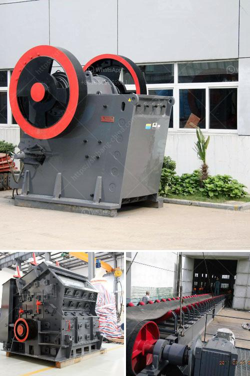

<h3>hammer mill bolivia</h3>
In the heart of South America lies Bolivia, a landlocked country renowned for its stunning landscapes, vibrant culture, and diverse agriculture. As the country strives to modernize its agricultural practices, one technology making a significant impact is the hammer mill. Designed to crush and pulverize a wide range of materials, the hammer mill has become a valuable tool in Bolivian farms and processing facilities.

The hammer mill is a mechanical device consisting of a rotating shaft fitted with hammers of various sizes. Its primary function is to grind and crush materials into smaller particles, making it an ideal solution for industries ranging from agriculture to mining. In Bolivia, it has emerged as a crucial component in improving the efficiency of agricultural processes.

One of the main applications of the hammer mill in Bolivia is in the processing of grains. Bolivia is known for its vast agricultural production, especially in crops like corn, wheat, and soybeans. These crops go through several stages before reaching the consumers. The hammer mill plays a vital role in this process by efficiently reducing the size of grains, making them easier to handle, store, and transport.

Farmers in Bolivia have been quick to recognize the benefits of the hammer mill. By utilizing this technology, they can now efficiently process their grain harvest, saving time and resources. Furthermore, the consistent particle size achieved through the hammer mill ensures a higher quality end product. This development has allowed Bolivian farmers to meet the demands of both domestic and international markets, opening up new opportunities for economic growth.

Additionally, the hammer mill proves invaluable in feed production. Bolivia has a thriving livestock industry, with both small-scale and commercial farms requiring nutritious animal feed. The hammer mill effectively grinds ingredients such as grains, hay, and straw, ensuring a homogeneous mixture that meets the specific dietary requirements of livestock. This technology has revolutionized the feed production process, enabling farmers to create custom formulations and optimize the nutritional content of their animal feed.

Beyond agriculture, the hammer mill is also influential in Bolivia's mining sector. Bolivia boasts significant mineral reserves, including tin, silver, zinc, and lead. The hammer mill is widely used in ore crushing, where it reduces large chunks of mineral deposits into smaller pieces for further processing. This technology increases efficiency and extraction rates, facilitating the extraction of minerals that drive Bolivia's economy.

While the adoption of the hammer mill in Bolivia has brought numerous benefits, challenges remain. Small-scale farmers and rural communities might find it challenging to access and afford this technology. Promoting awareness and facilitating financial assistance programs could help bridge this gap, ensuring that the benefits of the hammer mill reach all sectors of Bolivia's agricultural industry.

In conclusion, the hammer mill has emerged as a pivotal technology in Bolivia's agricultural sector. Its ability to grind and crush materials has transformed grain processing, feed production, and ore crushing practices. By adopting this technology, farmers and miners in Bolivia have experienced improved efficiency, higher-quality outputs, and increased economic opportunities. As the country continues to embark on its journey towards modernization, the hammer mill will undoubtedly play a vital role in advancing agricultural processes for years to come.
<h3>Contact us</h3><ul><li><strong>Whatsapp:&nbsp;<a href="https://wa.me/8613661969651">+8613661969651</a></strong></li><li><a href="https://swt.shibang-china.com/?git&amp;zhl&amp;hammer mill bolivia"><strong>Online Service(chat now)</strong></a></li></ul><h3>Related</h3><ul><li><a href='lister petter maize hammer mills.md'>lister petter maize hammer mills</a></li><li><a href='limestone crushing mill.md'>limestone crushing mill</a></li><li><a href='grinding mill machine.md'>grinding mill machine</a></li><li><a href='stone crusher machine in turkey.md'>stone crusher machine in turkey</a></li><li><a href='india grinding machine for talcum powder.md'>india grinding machine for talcum powder</a></li></ul>