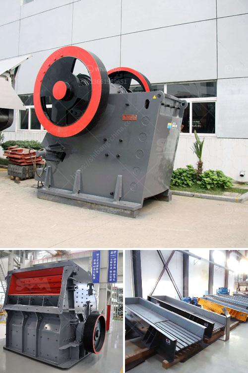

<h3>hammer mill capacity</h3>
A hammer mill is a versatile machine used in various industries for several purposes. One key aspect that significantly impacts the overall efficiency of the machine is the capacity. It refers to the amount of material the hammer mill can process in a given time, generally expressed in pounds per hour. Understanding the hammer mill capacity is crucial for optimal performance and profitability.

Hammer mills are widely utilized in food processing, animal feed production, biomass processing, and more. Their primary function is to grind and shred materials into smaller particles. This reduction in size is achieved by the repeated blows of hammers or blades that rotate at high speed inside the grinding chamber.

The capacity of a hammer mill depends on several factors, including the type of material being processed, the hammer configuration (number and size), screen size, and the rotor speed. It is essential to choose the right combination of these parameters to maximize the mill's output capacity.

One of the critical factors affecting capacity is the physical properties of the material being processed. Different materials have different characteristics such as hardness, density, moisture content, and particle size distribution. These factors influence how easily the material can be ground and how much material the hammer mill can process effectively. For example, materials with high moisture content tend to clog the mill, reducing the capacity. Conversely, brittle materials may be easily pulverized, resulting in higher capacity.

The hammer configuration also plays a vital role in determining the mill's capacity. Hammers come in various shapes, sizes, and materials, each with specific advantages and limitations. Heavier hammers generally provide higher impact force, resulting in better grinding efficiency. However, this can also increase wear and tear on the mill's components, leading to higher maintenance costs. It is essential to strike the right balance between hammer weight, design, and durability to optimize the capacity without compromising the overall performance.

Another key aspect is the screen size or perforation pattern on the grinding chamber's bottom. The screen serves as a sieve that regulates the final particle size. Choosing the appropriate screen size can significantly impact the capacity. A larger screen allows more material to pass through, increasing the overall throughput. However, this may result in a coarser final product, which might not be desirable for certain applications. Therefore, a balance must be achieved by selecting the optimal screen size to meet both the desired particle size and the required production capacity.

Lastly, the rotor speed has a direct influence on the mill's grinding efficiency and capacity. Higher rotor speeds generate greater centrifugal forces, improving the impact strength and grinding action. However, running the mill at excessively high speeds can lead to increased wear and power consumption while jeopardizing the overall integrity of the machine. It is crucial to find the optimal rotor speed that strikes a perfect balance between capacity, energy efficiency, and machine longevity.

In conclusion, the capacity of a hammer mill is a critical factor that affects the overall performance and profitability of the machine. By understanding and optimizing the various factors influencing capacity, such as material properties, hammer configuration, screen size, and rotor speed, manufacturers can achieve optimal grinding efficiency, throughput, and product quality. Investing time and effort in selecting the right combination of these factors can lead to substantial improvements in the hammer mill's overall capacity and performance.
<h3>Contact us</h3><ul><li><strong>Whatsapp:&nbsp;<a href="https://wa.me/8613661969651">+8613661969651</a></strong></li><li><a href="https://swt.shibang-china.com/?git&amp;zhl&amp;hammer mill capacity"><strong>Online Service(chat now)</strong></a></li></ul><h3>Related</h3><ul><li><a href='equipment used in small scale mining in ghana.md'>equipment used in small scale mining in ghana</a></li><li><a href='feldspar grinding machine chennai suppliers.md'>feldspar grinding machine chennai suppliers</a></li><li><a href='stone crusher plant philippines.md'>stone crusher plant philippines</a></li><li><a href='sale of crushers in malaysia.md'>sale of crushers in malaysia</a></li><li><a href='portable stone crushers uganda for sale.md'>portable stone crushers uganda for sale</a></li></ul>