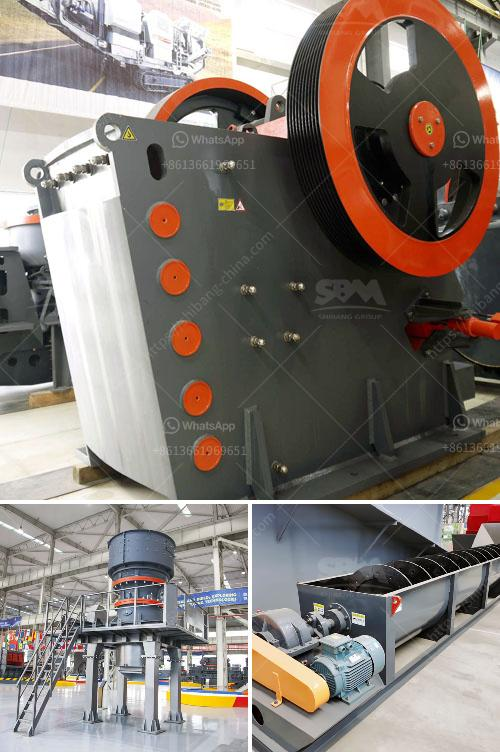

<h3>hammer mill crusher batubara</h3>
In the coal mining industry, the hammer mill crusher batubara is a highly efficient and multifunctional crushing machine. It is designed to effectively crush and grind coal to the desired fineness for further processing. It is widely used in coal power plants, coal washing plants, and coal yards for crushing coals into small pieces that can be easily transported and processed.

The hammer mill crusher batubara is composed of a crushing chamber, rotor, hammer, lining plate, sieve plate, and other components. The crushed coal is discharged through a sieve plate at the bottom of the crusher. The vibrating screen controls the particle size of the crushed coal and can be adjusted according to user requirements.

One of the key advantages of the hammer mill crusher batubara is its high crushing ratio. The hammer crusher uses a unique crushing mechanism that relies on the high-speed rotation of the hammer to crush materials. Compared to other types of coal crushers, it has a larger crushing ratio and higher production capacity. This ensures that a greater amount of coal can be processed in a shorter period, improving efficiency and reducing energy consumption.

Additionally, the hammer mill crusher batubara is known for its versatility. It can be used for crushing both dry and wet materials, making it suitable for various applications. Whether the coal is wet or contains high moisture content, this crusher can effectively process it without clogging or blockage issues. This versatility makes it an ideal choice for coal crushing in different environments.

Furthermore, the design of the hammer mill crusher batubara ensures minimal maintenance needs. The hammers and other wear parts are made of high-quality materials, ensuring their durability and long lifespan. The crusher's compact structure and simple operation also contribute to its low maintenance requirements. With regular maintenance and proper care, this crusher can operate consistently and reliably for an extended period.

In terms of safety, the hammer mill crusher batubara is designed with several safety features. It is equipped with a safety door interlock system that ensures the crusher cannot be opened during operation, protecting the user from potential accidents. The crusher also has a reliable overload protection system that automatically shuts down the equipment when it detects excessive load or foreign objects, preventing damage to the crusher and ensuring the safety of the operator.

In conclusion, the hammer mill crusher batubara is a highly efficient and reliable crushing machine for coal mining operations. It offers a high crushing ratio, excellent versatility, minimal maintenance needs, and various safety features. With its outstanding performance and durability, this crusher has become an essential equipment in the coal industry. Whether it is used in coal power plants, coal washing plants, or coal yards, the hammer mill crusher batubara ensures efficient coal crushing, contributing to a more sustainable and productive coal mining industry.
<h3>Contact us</h3><ul><li><strong>Whatsapp:&nbsp;<a href="https://wa.me/8613661969651">+8613661969651</a></strong></li><li><a href="https://swt.shibang-china.com/?git&amp;zhl&amp;hammer mill crusher batubara"><strong>Online Service(chat now)</strong></a></li></ul><h3>Related</h3><ul><li><a href='cost in india of 100 ton mobile limestone crusher.md'>cost in india of 100 ton mobile limestone crusher</a></li><li><a href='coal charcoal crushing grinding machine small.md'>coal charcoal crushing grinding machine small</a></li><li><a href='sand washing machines for crusher nepal.md'>sand washing machines for crusher nepal</a></li><li><a href='gold wash plant equipment in ghana.md'>gold wash plant equipment in ghana</a></li><li><a href='cost of feldsper processing machine.md'>cost of feldsper processing machine</a></li></ul>