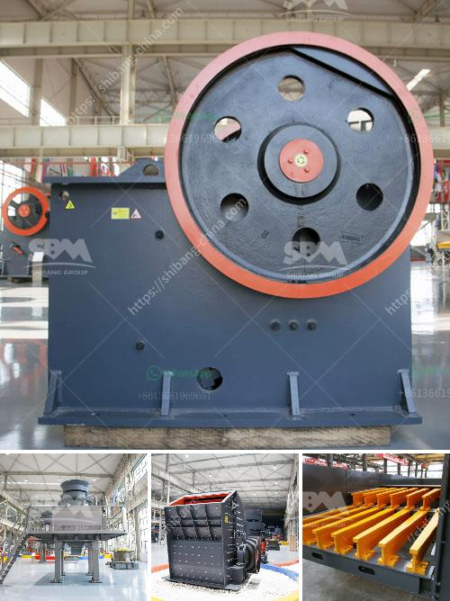

<h3>hammer mill crusher price</h3>
If you're exploring the possibility of getting a hammer mill crusher for your business, you should start with a clear understanding of its purpose and function. This robust machine is designed to break down large chunks of material into fine particles suitable for various industrial applications. With so many options available on the market, it's crucial to consider the price factor while making your decision.

When it comes to hammer mill crusher prices, there are several factors to consider. The first is the machine's specifications, which determine its capacity, motor rating, and feed size limits. Higher-capacity machines with powerful motors can handle larger volumes and coarser materials, making them ideal for heavy-duty grinding operations. However, they often come with higher price tags.

The second consideration is the type of hammer mill crusher you need for your specific application. There are two main types available: reversible and non-reversible hammer mill crushers. Reversible crushers offer greater versatility, as they can be used in both directions, extending the lifespan of the hammers. On the other hand, non-reversible crushers are simpler in design and generally cost less.

The next crucial aspect to consider is the quality of the materials used in the hammer mill crusher's construction. High-quality materials, such as cast steel or alloy steel, result in better performance and durability. Although machines made from these materials tend to be more expensive, they offer a longer lifespan, reducing the need for frequent replacements and repairs.

In addition to the initial cost, it's essential to consider the long-term expenses associated with a hammer mill crusher. These include operating costs, maintenance expenses, and energy consumption. Higher-quality machines with efficient design features can help reduce these long-term expenses, balancing out the initial investment.

Once you've evaluated these factors, it's time to compare prices from different manufacturers and suppliers. It is worth noting that the hammer mill crusher market is highly competitive, so it's important to do thorough research to find the best deal. Consider reaching out to multiple suppliers to request quotes and inquire about any ongoing promotions or discounts they may offer.

Don't forget to look beyond price alone. Pay attention to the manufacturer's reputation, customer reviews, and aftersales support offered. A reliable manufacturer will provide peace of mind with warranties, spare parts availability, and technical assistance when needed.

In conclusion, the price of a hammer mill crusher is determined by factors such as machine specifications, type, quality of construction materials, and long-term expenses. It's crucial to strike a balance between initial investment and long-term benefits, focusing on the machine's performance, durability, and operational efficiency. By carefully considering these factors and comparing prices from reputable suppliers, you'll be able to make an informed decision and select the right hammer mill crusher for your business needs.
<h3>Contact us</h3><ul><li><strong>Whatsapp:&nbsp;<a href="https://wa.me/8613661969651">+8613661969651</a></strong></li><li><a href="https://swt.shibang-china.com/?git&amp;zhl&amp;hammer mill crusher price"><strong>Online Service(chat now)</strong></a></li></ul><h3>Related</h3><ul><li><a href='mini cement plant for sale 500tpd.md'>mini cement plant for sale 500tpd</a></li><li><a href='malaysia grinder hammer mill manufacturer.md'>malaysia grinder hammer mill manufacturer</a></li><li><a href='crusher machine manufacturers.md'>crusher machine manufacturers</a></li><li><a href='vibration screen machine.md'>vibration screen machine</a></li><li><a href='ultrafine grinding mill.md'>ultrafine grinding mill</a></li></ul>