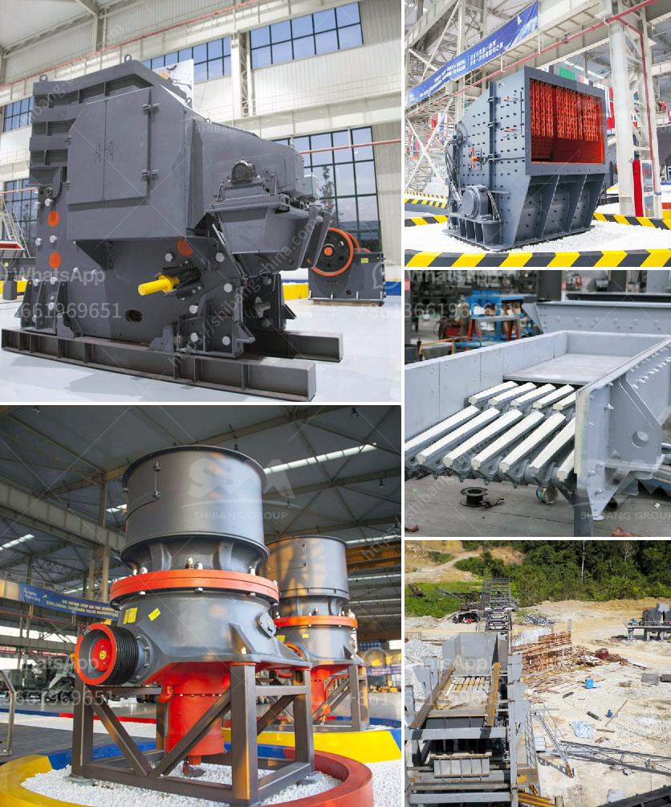

<h3>hammer mill crusher type</h3>
Hammer mill crushers are a popular choice in the mining industry due to their high efficiency, versatility, and ability to break down hard materials. This article will explore the various types of hammer mill crushers and their key components.

Hammer mill crushers are used for crushing and pulverizing materials such as limestone, sandstone, schist, gypsum, coal, and more. These machines have many distinct advantages over traditional crushers including high efficiency, flexibility, and reliability.

The major components of a hammer mill crusher include a hopper, inlet, crushing chamber, rotor, hammer bars, and a discharge outlet. These components work together for breaking down the material into specific sizes.

The hopper in a hammer mill crusher is usually a conveyor or other storage device that holds the raw material to be crushed. The hopper feeds the material into the crushing chamber through an inlet, typically located at the top of the crusher.

The crushing chamber, also known as the grinding chamber, is where the material is pulverized. It contains a rotor with hammer bars that spin at high speeds. The hammer bars strike the material and break it into smaller pieces.

The rotor is the central component of a hammer mill crusher. It consists of a main shaft, a number of discs, and hammers mounted on the shaft. The rotor spins at high speeds, causing the hammers to strike the material and break it down.

The hammer bars are the hammers attached to the rotor. They strike the material, causing it to break into smaller pieces. The number and arrangement of the hammer bars can vary depending on the desired output size and the material being crushed.

The discharge outlet is where the crushed material exits the crusher. It is typically located at the bottom of the crusher and may be connected to a conveyor or other transportation system for further processing.

There are various types of hammer mill crushers available in the market, each with its own unique features and advantages. Some common types include:

1. Single rotor hammer mill crusher: This type of crusher features a single rotor rotating at high speeds. It is designed for crushing brittle materials and can produce a wide range of particle sizes.

2. Double rotor hammer mill crusher: This type of crusher features two rotors rotating at high speeds. It is often used for crushing larger materials and can produce a more uniform particle size distribution.

3. Reversible hammer mill crusher: This type of crusher allows the rotor to be reversed, enabling the hammers to be used in different positions. This maximizes the lifespan of the hammers and reduces downtime for maintenance.

4. Impact mill crusher: This type of crusher utilizes impact force to crush materials. It is often used for fine crushing applications and can produce a uniform particle size distribution.

In conclusion, hammer mill crushers are a versatile and efficient option for crushing and pulverizing a wide range of materials. They are widely used in the mining industry and have numerous advantages over traditional crushers. When choosing a hammer mill crusher type, it is important to consider factors such as the desired output size, the material being crushed, and the specific application requirements.
<h3>Contact us</h3><ul><li><strong>Whatsapp:&nbsp;<a href="https://wa.me/8613661969651">+8613661969651</a></strong></li><li><a href="https://swt.shibang-china.com/?git&amp;zhl&amp;hammer mill crusher type"><strong>Online Service(chat now)</strong></a></li></ul><h3>Related</h3><ul><li><a href='150 tpd cement line price.md'>150 tpd cement line price</a></li><li><a href='frac sand mine feasibility study.md'>frac sand mine feasibility study</a></li><li><a href='price for 100 tph impact crusher.md'>price for 100 tph impact crusher</a></li><li><a href='granite quarry machinery for sale.md'>granite quarry machinery for sale</a></li><li><a href='conveyor belts in coacalco de berriozabal.md'>conveyor belts in coacalco de berriozabal</a></li></ul>