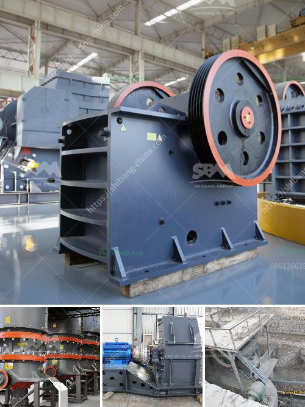

<h3>hammer mill edipesa</h3>
Grinding is an essential process in various industries, including agriculture, mining, and construction. It involves reducing the size of materials to a finer form, increasing their surface area for better consistency and performance. One tool that has revolutionized the grinding process is the hammer mill. And when it comes to reliable and top-quality hammer mills, Hammer Mill Edipesa is a name that stands out.

Hammer Mill Edipesa is a renowned brand in the agriculture and mining industries, providing efficient grinding solutions for years. The company has consistently delivered high-performing equipment that exceeds customer expectations when it comes to durability and productivity. Let's dive deeper into what makes Hammer Mill Edipesa a trusted choice for many industries.

One of the key features of Hammer Mill Edipesa is its robust construction. These machines are designed to handle heavy-duty applications and endure prolonged use. Made from high-quality materials, their sturdy build ensures long-lasting performance, reducing downtime and costly maintenance. Whether it's grinding grains, minerals, or organic materials, Hammer Mill Edipesa can efficiently handle even the toughest tasks.

Another advantage of Hammer Mill Edipesa is its versatility. These machines are capable of grinding a wide range of materials, making them suitable for various industries. From grains, maize, and soybeans in the agriculture sector to ores, coal, and limestone in mining, Hammer Mill Edipesa can handle it all. The ability to process different materials adds value to these machines, allowing users to maximize their investment.

Efficiency is another crucial aspect of Hammer Mill Edipesa. These machines are specifically designed for high-speed grinding, ensuring speedy and consistent results. With their advanced technology, Hammer Mill Edipesa can grind materials to the desired particle size with precision and uniformity. This efficiency not only saves time and energy but also enhances the overall quality of the end product.

Moreover, Hammer Mill Edipesa offers a range of customizable options to meet specific grinding requirements. Customers can choose from different screen sizes, rotor configurations, and motor power, tailoring the machine to their specific needs. This flexibility allows users to achieve optimal grinding performance, ensuring maximum productivity and cost-effectiveness.

Additionally, Hammer Mill Edipesa prioritizes safety. These machines are equipped with safety features, such as emergency stop buttons, guards, and interlocks, to protect operators from potential hazards. The company's commitment to safety ensures that users can operate the machines with peace of mind, minimizing the risk of accidents or injuries.

In conclusion, the Hammer Mill Edipesa is a reliable and efficient grinding tool suitable for various industries. With its robust construction, versatility, and high-performance capabilities, it has become a go-to choice for many businesses. Moreover, its customizable options, efficiency, and emphasis on safety further enhance its appeal. If you are in need of a top-quality hammer mill, look no further than Hammer Mill Edipesa. It is undoubtedly a wise investment that will deliver exceptional results for your grinding needs.
<h3>Contact us</h3><ul><li><strong>Whatsapp:&nbsp;<a href="https://wa.me/8613661969651">+8613661969651</a></strong></li><li><a href="https://swt.shibang-china.com/?git&amp;zhl&amp;hammer mill edipesa"><strong>Online Service(chat now)</strong></a></li></ul><h3>Related</h3><ul><li><a href='sand vsi crusher.md'>sand vsi crusher</a></li><li><a href='vibrating screens 250tph.md'>vibrating screens 250tph</a></li><li><a href='about used stone crushers in america.md'>about used stone crushers in america</a></li><li><a href='mobile crushers in mining.md'>mobile crushers in mining</a></li><li><a href='list of gold mining company in zimbabwe.md'>list of gold mining company in zimbabwe</a></li></ul>