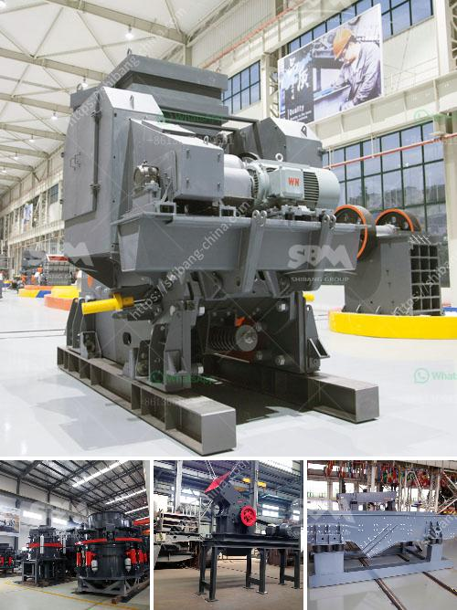

<h3>hammer mill equipment south africa price</h3>
Are you in the market for a hammer mill? If so, you're in luck! South Africa offers a wealth of hammer mill equipment options. These robust and highly efficient mills are specifically designed to pulverize materials into smaller particles, making them ideal for industries such as mining, construction, and agriculture.

One of the most compelling reasons to invest in a hammer mill is its affordability. Despite its exceptional capabilities, hammer mill equipment in South Africa is available at a surprisingly competitive price. With a wide range of models and sizes to choose from, finding the perfect hammer mill for your needs and budget has never been easier.

But why should you consider purchasing this equipment? Well, hammer mills offer numerous advantages that make them an essential asset in a variety of industries. Firstly, the ability to reduce material size through high-speed hammering ensures a more efficient and cost-effective grinding process. This results in increased productivity while reducing energy consumption.

Hammer mills are also known for their versatility. With the right screens and rotor configurations, they can handle a wide range of materials, from grains and feed to wood chips and even scrap metal. This adaptability allows manufacturers and producers to maximize their investment by using a single machine for different applications.

Furthermore, hammer mills are built to withstand heavy-duty operation and require minimal maintenance. This durability guarantees a longer lifespan and reduced downtime, resulting in higher overall production rates and increased profits.

When considering the price of hammer mill equipment in South Africa, it's essential to look beyond the initial cost and focus on the long-term benefits. By investing in a high-quality hammer mill, you're not only acquiring a valuable asset but also ensuring your business remains competitive and efficient.

In conclusion, hammer mill equipment in South Africa offers an exceptional value proposition. Its affordability, versatility, and durability make it a wise investment for businesses in various industries. So, if you're looking to improve your grinding processes and boost productivity, consider adding a hammer mill to your equipment lineup. You won't be disappointed!
<h3>Contact us</h3><ul><li><strong>Whatsapp:&nbsp;<a href="https://wa.me/8613661969651">+8613661969651</a></strong></li><li><a href="https://swt.shibang-china.com/?git&amp;zhl&amp;hammer mill equipment south africa price"><strong>Online Service(chat now)</strong></a></li></ul><h3>Related</h3><ul><li><a href='crusher plant quarry philippines.md'>crusher plant quarry philippines</a></li><li><a href='puzzolana crushers coimbatore.md'>puzzolana crushers coimbatore</a></li><li><a href='project report on mini kaolin mining crusher.md'>project report on mini kaolin mining crusher</a></li><li><a href='small grinding mill machine in india.md'>small grinding mill machine in india</a></li><li><a href='gypsum board making process.md'>gypsum board making process</a></li></ul>