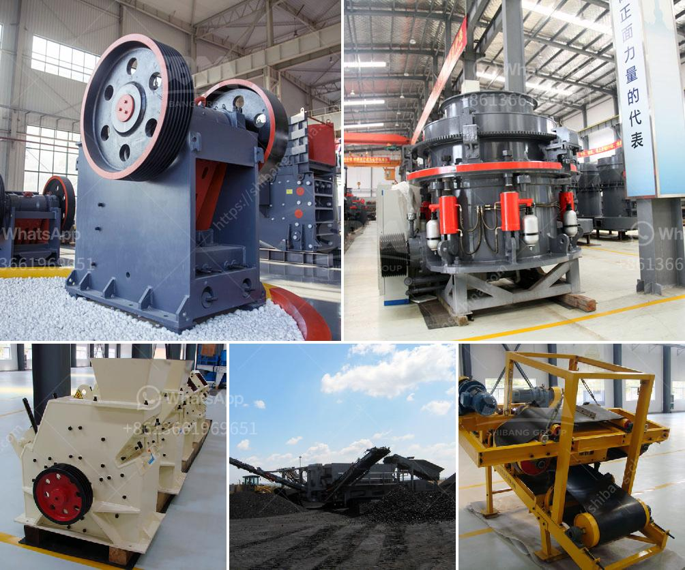

<h3>hammer mill for limestone in south africa</h3>
Limestone is one of the most versatile and valuable natural resources in South Africa. It is a sedimentary rock that is mainly composed of calcium carbonate, which is the primary component of the mineral calcite. Limestone plays an important role in different industries, such as construction and agriculture, as it can be used as a raw material for the production of cement, lime, and fertilizer. To process this mineral resource, South Africa limestone hammer mills are an ideal choice.

A hammer mill is a machine that uses a series of hammers to crush and pulverize various materials. This machine works on the principle of impact and attrition, which means that the material is reduced in size by successive hammer blows until it is small enough to pass through a screen or a grate. In the case of limestone, the hammer mill crushes and grinds the material into a powder-like consistency.

There are several benefits to using a hammer mill for processing limestone in South Africa. One of the main advantages is the ability to produce a wide range of particle sizes. This flexibility in sizing allows for the production of different types of cement and other materials that require specific particle sizes. Another advantage is the high throughput of the hammer mill. Due to its design, this machine can process large quantities of limestone in a relatively short period, making it efficient and cost-effective.

Furthermore, the hammer mill for limestone in South Africa is environmentally friendly. The machine is designed with a dust suppression system, which helps to reduce the amount of dust generated during the crushing and grinding process. This ensures a cleaner and safer working environment for the operators and helps to minimize the impact on the surrounding ecosystem.

In addition to its efficiency and environmental benefits, the hammer mill is also a durable and reliable machine. It is built to withstand the harsh conditions of the limestone processing industry, including high temperatures and abrasive materials. The hammers are made of high-quality steel, which ensures a long lifespan and reduces the need for frequent replacements.

When it comes to purchasing a hammer mill for limestone in South Africa, there are various factors to consider. One important aspect is the reputation and expertise of the manufacturer. It is advisable to choose a reputable company with a proven track record in the industry. Additionally, the size and capacity of the machine should match the specific requirements of the operation. This ensures optimal performance and maximum productivity.

In conclusion, a hammer mill for limestone in South Africa is an indispensable tool for the limestone processing industry. It offers a range of benefits, including high throughput, flexible particle sizing, and environmentally friendly operation. When choosing a hammer mill, it is crucial to select a reliable manufacturer and ensure that the machine meets the specific requirements of the operation.
<h3>Contact us</h3><ul><li><strong>Whatsapp:&nbsp;<a href="https://wa.me/8613661969651">+8613661969651</a></strong></li><li><a href="https://swt.shibang-china.com/?git&amp;zhl&amp;hammer mill for limestone in south africa"><strong>Online Service(chat now)</strong></a></li></ul><h3>Related</h3><ul><li><a href='gold wash plant for sale in the usa.md'>gold wash plant for sale in the usa</a></li><li><a href='set up coal pulverizer plant.md'>set up coal pulverizer plant</a></li><li><a href='cost of 200 tpd clinker grinding plant.md'>cost of 200 tpd clinker grinding plant</a></li><li><a href='5 raymond roller mill.md'>5 raymond roller mill</a></li><li><a href='price of grinding mills in kenya.md'>price of grinding mills in kenya</a></li></ul>