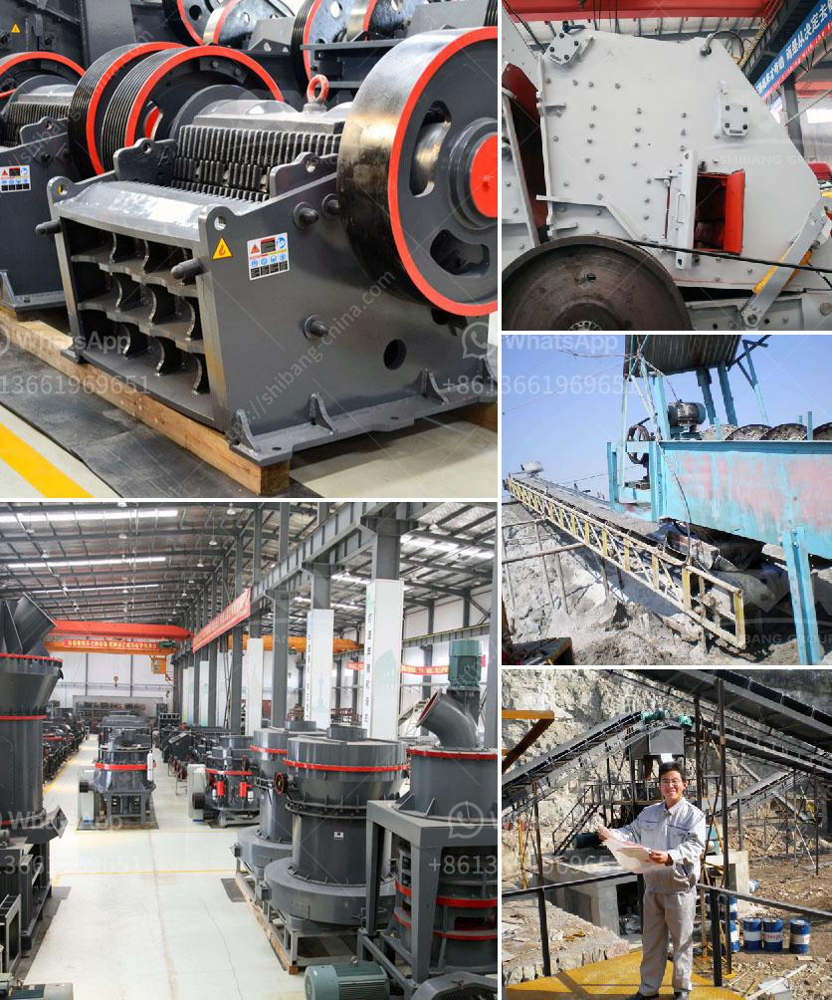

<h3>hammer mill for oregano</h3>
The hammer mill is an essential machinery in the pharmaceutical and food processing industries. It is used to crush, shred, granulate, and pulverize materials, enabling them to be more easily processed. Hammer mills are versatile machines that can be used for a wide range of applications, including grinding oregano leaves.

Oregano is a culinary and medicinal herb that is commonly used in Mediterranean cuisine. It is known for its strong and aromatic flavor, as well as its many health benefits. To extract the maximum flavor and potency from oregano leaves, they need to be finely ground. This is where the hammer mill comes into play.

A hammer mill operates by forcefully rotating a disc with hammers, which are attached to pivots on the rotor. As the disc rotates, the hammers strike the material and comminute it into smaller particles. The size reduction achieved by a hammer mill depends on the size and shape of the holes in the screen used for particle separation. The mill can produce particles ranging from a few millimeters to less than 100 micrometers.

The benefits of using a hammer mill for grinding oregano are numerous. Firstly, the mill reduces the material into smaller particles. This increases the surface area of the oregano, allowing for a more efficient extraction of its essential oils and nutrients during further processing. Finer particles also release the aroma and taste of oregano more effectively, resulting in a more flavorful end product.

Additionally, the hammer mill enables uniform particle size distribution. This is crucial for certain applications where precise control over particle size is required. For example, in the food industry, oregano powder with a consistent particle size is essential for achieving the desired flavor and texture in products such as seasonings and condiments.

Another advantage of using a hammer mill for grinding oregano is its versatility. The mill can handle different types of oregano leaves, whether fresh or dried, without clogging or damaging the machine. It is also capable of grinding other herbs, spices, grains, and materials, making it a valuable tool in a variety of processing applications.

Furthermore, the hammer mill is a cost-effective solution for grinding oregano. It is a compact and robust machine that requires relatively low maintenance and operating costs compared to other grinding equipment. Its simple design and ease of operation make it accessible to small-scale producers and start-ups in the food and pharmaceutical industries.

In conclusion, the hammer mill is a crucial piece of machinery for grinding oregano leaves and other materials. Its ability to reduce particle size, ensure uniform distribution, and enhance flavor and aroma makes it an invaluable tool in the food and pharmaceutical industries. Its versatility, cost-effectiveness, and ease of use are further advantages that make the hammer mill an excellent choice for processing oregano and other ingredients.
<h3>Contact us</h3><ul><li><strong>Whatsapp:&nbsp;<a href="https://wa.me/8613661969651">+8613661969651</a></strong></li><li><a href="https://swt.shibang-china.com/?git&amp;zhl&amp;hammer mill for oregano"><strong>Online Service(chat now)</strong></a></li></ul><h3>Related</h3><ul><li><a href='hammer mill south africa.md'>hammer mill south africa</a></li><li><a href='chrome processing plant price.md'>chrome processing plant price</a></li><li><a href='used crushers in america.md'>used crushers in america</a></li><li><a href='grinding mills ghana.md'>grinding mills ghana</a></li><li><a href='crushed price impact crusher price.md'>crushed price impact crusher price</a></li></ul>