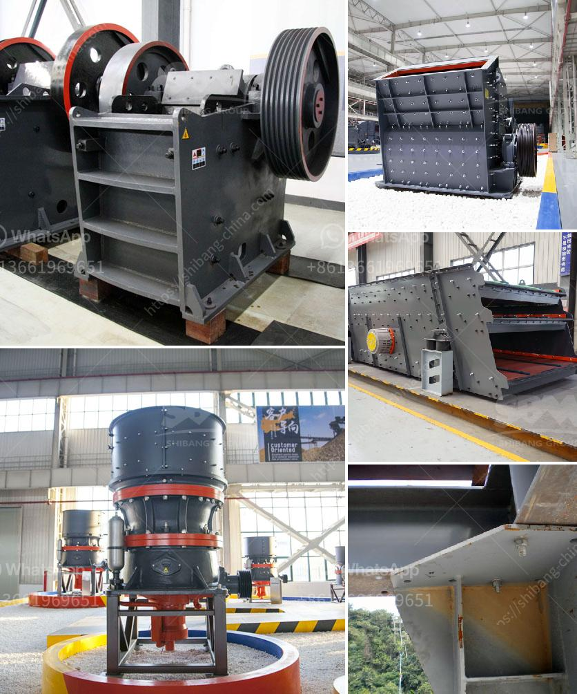

<h3>hammer mill for quartz rock</h3>
If you have a Quartz rock that you want to process, the first question you might have is "What is a hammer mill?" A hammer mill is a machine used to crush or shred materials into smaller pieces. The basic design of this type of mill involves a rotating shaft or drum with hammers attached, which are free to swing on the ends and crush the material as it rotates.

When it comes to processing Quartz rock, a hammer mill is commonly used for the initial size reduction. Although it is possible to use other types of mills, such as impact mills or ball mills, to perform this task, a hammer mill offers a cost-effective and efficient option.

The reason why a hammer mill is a popular choice for rock processing is its ability to crush rocks into uniform particles. This ensures that the extracted material maintains a consistent size, which can be crucial for further processing and refining. Whether you are extracting Quartz for industrial purposes, such as the manufacturing of glass or electronics, or for landscaping and construction projects, a hammer mill can streamline the process and save valuable time and resources.

One of the primary advantages of using a hammer mill for Quartz rock is its versatility. This machine can handle a wide range of materials, from soft to medium-hard rocks, making it suitable for various applications. Additionally, you can easily adjust the gap between the hammers and the screen to achieve the desired size of the output material. This flexibility makes a hammer mill a versatile and adaptable tool for rock processing.

Another advantage of using a hammer mill is its simplicity and ease of operation. Unlike some other mills, a hammer mill does not require intricate controls or complex settings. It is designed to be user-friendly, with straightforward maintenance and minimal downtime. This simplicity makes it accessible to both small-scale hobbyists and large industrial operations alike.

One thing to keep in mind when using a hammer mill for Quartz rock is the need for constant monitoring and maintenance. The powerful swinging hammers can cause wear and tear on the commonly used manganese steel grates or screens over time. It is essential to regularly check and replace these parts to ensure optimal performance and prevent any potential issues.

In conclusion, a hammer mill is an effective tool for processing Quartz rock. Its ability to crush rocks into uniform particles, versatility, and ease of operation make it an excellent choice for various applications. However, it is essential to keep in mind the need for regular maintenance to achieve consistent results. By investing in a high-quality hammer mill and following proper maintenance procedures, you can ensure efficient rock processing and achieve the desired output for your Quartz rock applications.
<h3>Contact us</h3><ul><li><strong>Whatsapp:&nbsp;<a href="https://wa.me/8613661969651">+8613661969651</a></strong></li><li><a href="https://swt.shibang-china.com/?git&amp;zhl&amp;hammer mill for quartz rock"><strong>Online Service(chat now)</strong></a></li></ul><h3>Related</h3><ul><li><a href='calcium carbonate grinding industries in india.md'>calcium carbonate grinding industries in india</a></li><li><a href='equipment used in small scale mining in ghana.md'>equipment used in small scale mining in ghana</a></li><li><a href='machine for crushing rock.md'>machine for crushing rock</a></li><li><a href='calcium phosphate crusher.md'>calcium phosphate crusher</a></li><li><a href='set up coal pulverizer plant.md'>set up coal pulverizer plant</a></li></ul>