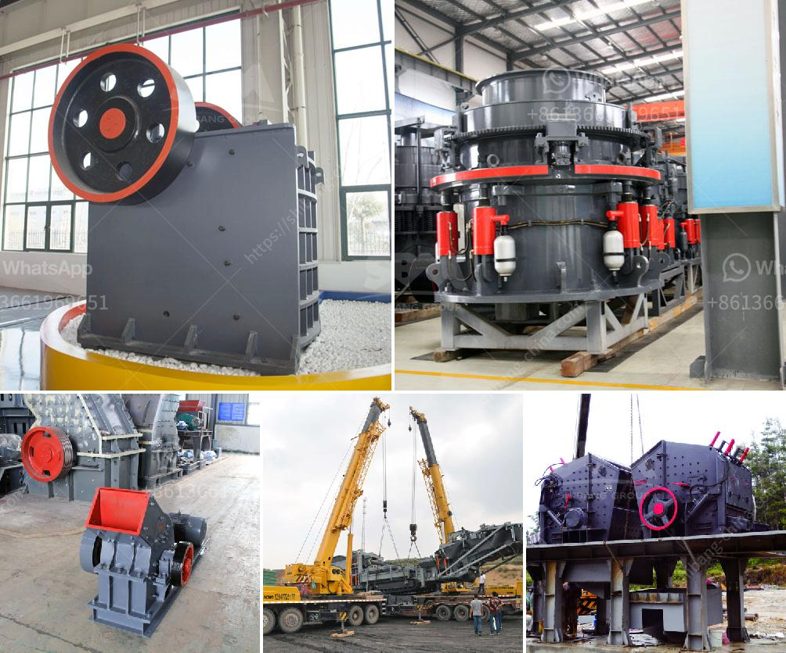

<h3>hammer mill for sale south africa</h3>
Hammer mills are widely used in various industries, especially in the agricultural sector. They are used to crush and grind different types of raw materials to produce various forms of animal feed, such as poultry feed and pet food.

A hammer mill for sale South Africa is a versatile equipment that can be used in a wide range of industries. Some of the possible applications include mining, coal, metallurgy, paper, and waste management. However, several factors must be considered before choosing a suitable hammer mill for sale.

The size of the hammer mill determines the distance the hammers can throw the raw material. This affects the efficiency and quality of the grind. Hammer mills with larger rotor diameter and wider feed inlet are capable of processing larger raw materials and producing finer grinds. On the other hand, smaller mills are suitable for processing smaller materials and coarse grinds.

Another important factor to consider when looking for a hammer mill for sale is the horsepower (HP) rating. The horsepower determines the power output and capacity of the mill. Higher HP ratings are generally preferred for large-scale production where higher throughput is required. However, for smaller-scale operations, a lower HP rating can suffice.

The design and construction of the hammer mill should also be taken into account. A durable and robust mill is essential for prolonged use without frequent breakdowns or maintenance. The mill should be built with quality materials that can withstand the pressure and impact of the grinding process. Additionally, proper insulation and dust extraction systems should be in place to ensure safe and efficient operation.

In South Africa, hammer mills are commonly used in farming and agricultural industries. These industries require the milling of various grains and crops into a finer form for animal feed. A hammer mill for sale can be used to mill barley, oats, corn, sorghum, wheat, and many other grains. The mill is versatile and can also be used for grinding herbs, spices, and nuts to make delicious recipes.

When using the hammer mill for sale in South Africa, ensure that there is proper ventilation to prevent heat build-up and dust explosions. Also, ensure that the hammers are replaced regularly to maintain optimal performance. It is recommended to consult with professionals or suppliers to determine the correct size and type of hammers for your specific needs.

In conclusion, a hammer mill for sale in South Africa is a versatile equipment that can be used in various industries, such as mining, coal, metallurgy, paper, and waste management. It is important to carefully consider factors such as size, horsepower, design, and construction before choosing a suitable hammer mill. Proper maintenance and safety precautions should also be taken to ensure efficient operation and longevity of the mill. Consult with professionals or suppliers for expert advice and assistance in selecting the right hammer mill for your specific requirements.
<h3>Contact us</h3><ul><li><strong>Whatsapp:&nbsp;<a href="https://wa.me/8613661969651">+8613661969651</a></strong></li><li><a href="https://swt.shibang-china.com/?git&amp;zhl&amp;hammer mill for sale south africa"><strong>Online Service(chat now)</strong></a></li></ul><h3>Related</h3><ul><li><a href='ball mill specification.md'>ball mill specification</a></li><li><a href='limestone processing crusher.md'>limestone processing crusher</a></li><li><a href='gyratory crusher advantages and disadvantages.md'>gyratory crusher advantages and disadvantages</a></li><li><a href='qurry crusher plant capacity.md'>qurry crusher plant capacity</a></li><li><a href='small scale electric arc ferrochrome smelting.md'>small scale electric arc ferrochrome smelting</a></li></ul>