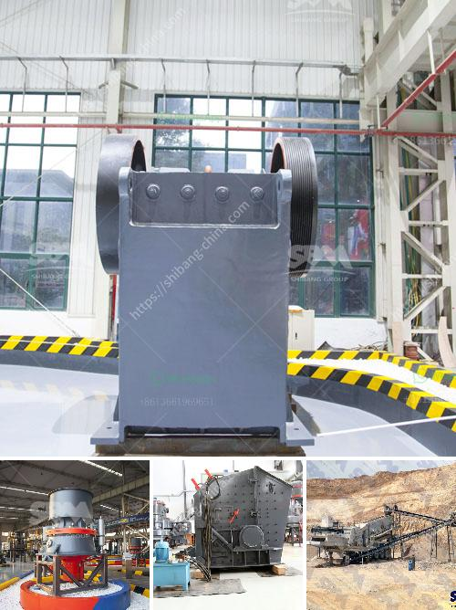

<h3>hammer mill grinder 10 mm</h3>
A hammer mill grinder is one of the most efficient machines that exists when it comes to breaking down materials into smaller, more manageable pieces. This equipment is widely used in industries such as mining, agriculture, and food processing to grind materials that are incredibly hard, brittle, or fibrous.

One of the key features of a hammer mill grinder is its ability to produce an even grind size that can be adjusted by simply changing the screen size. This makes it ideal for applications where consistency is crucial, such as in the production of animal feed or the processing of biomass for renewable energy.

The 10 mm hammer mill grinder is particularly versatile as it can handle a wide range of particle sizes. This means that it can be used to process both small and large materials. Whether you need to grind grains, herbs, or even plastics, this equipment can get the job done efficiently and effectively.

In terms of throughput, a hammer mill grinder with a 10 mm screen can typically process around 100-300 kilograms of material per hour. However, this can vary depending on several factors including the type of material being processed, the desired grind size, and the specific model of the grinder.

Another benefit of using a hammer mill grinder is its low operating costs. The machine operates at a low noise level, requires minimal maintenance, and consumes less energy compared to other grinding machines. This makes it a cost-effective solution for businesses looking to maximize their productivity without breaking the bank.

In conclusion, a hammer mill grinder with a 10 mm screen is a versatile and efficient machine for grinding a wide range of materials. Whether you are involved in mining, agriculture, or food processing, this equipment can help you achieve the desired grind size with ease. Its low operating costs and high throughput make it a valuable addition to any processing facility.
<h3>Contact us</h3><ul><li><strong>Whatsapp:&nbsp;<a href="https://wa.me/8613661969651">+8613661969651</a></strong></li><li><a href="https://swt.shibang-china.com/?git&amp;zhl&amp;hammer mill grinder 10 mm"><strong>Online Service(chat now)</strong></a></li></ul><h3>Related</h3><ul><li><a href='cobble stone project in ethiopia.md'>cobble stone project in ethiopia</a></li><li><a href='rental companies of mobile crusher.md'>rental companies of mobile crusher</a></li><li><a href='gypsum granules plant manufacturer in india.md'>gypsum granules plant manufacturer in india</a></li><li><a href='sand and quarry importer in singapore.md'>sand and quarry importer in singapore</a></li><li><a href='brick crushing equipment.md'>brick crushing equipment</a></li></ul>