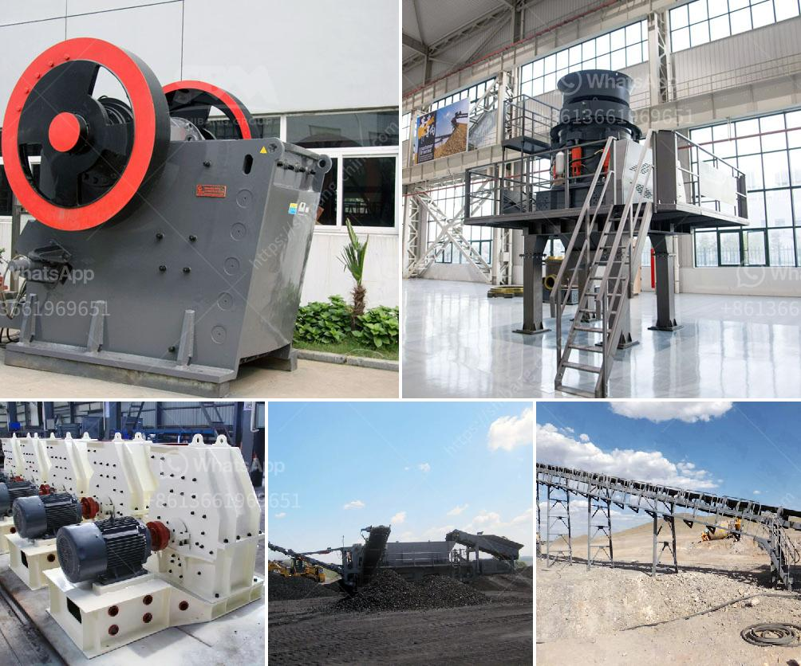

<h3>hammer mill in japan</h3>
The hammer mill is a piece of equipment used to shred or crush materials into smaller pieces. It is popularly used in a wide array of industries including electronics manufacturing, recycling, and food processing. In Japan, the hammer mill has gained immense popularity due to its efficiency and versatility.

One of the key industries where the hammer mill shines in Japan is the recycling sector. With Japan's commitment to sustainable development and waste management, recycling facilities are essential. The hammer mill plays a crucial role in these facilities as it helps break down various recyclable materials such as plastic, aluminum, and glass. By processing them into smaller particles, the materials can be further sorted and repurposed for manufacturing new products.

In the electronics manufacturing industry, the hammer mill is a valuable tool for processing electronic waste. Japan is renowned for its advanced technology and electronic gadgets, resulting in a significant amount of electronic waste. The hammer mill efficiently reduces large electronic components into more manageable sizes, making it easier to extract valuable materials like copper, gold, and silver.

Food processing is another sector in Japan that greatly benefits from the application of hammer mills. Japanese cuisine involves intricate food preparation techniques that often require finely ground ingredients. The hammer mill's ability to finely grind spices, herbs, and other food products makes it an essential tool in the creation of high-quality, flavorful dishes.

Overall, the hammer mill is a versatile and indispensable piece of equipment in various industries in Japan. Its ability to efficiently break down and process materials has made it a key component in recycling facilities, electronics manufacturing, and food processing. As Japan continues to prioritize sustainability and technological advancement, the demand for hammer mills will undoubtedly remain strong.
<h3>Contact us</h3><ul><li><strong>Whatsapp:&nbsp;<a href="https://wa.me/8613661969651">+8613661969651</a></strong></li><li><a href="https://swt.shibang-china.com/?git&amp;zhl&amp;hammer mill in japan"><strong>Online Service(chat now)</strong></a></li></ul><h3>Related</h3><ul><li><a href='gold processing equipment for sale in zimbabwe.md'>gold processing equipment for sale in zimbabwe</a></li><li><a href='price of dolomite grinding machine stone crusher machine.md'>price of dolomite grinding machine stone crusher machine</a></li><li><a href='ballast crushers alibaba.md'>ballast crushers alibaba</a></li><li><a href='sizing jaw crusher.md'>sizing jaw crusher</a></li><li><a href='raymond mill from china best supplier on sale.md'>raymond mill from china best supplier on sale</a></li></ul>